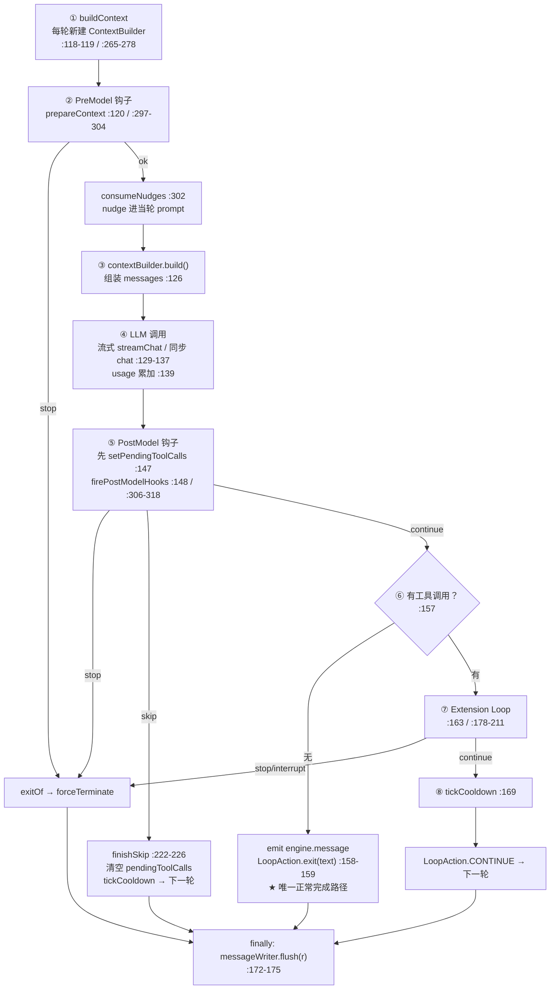
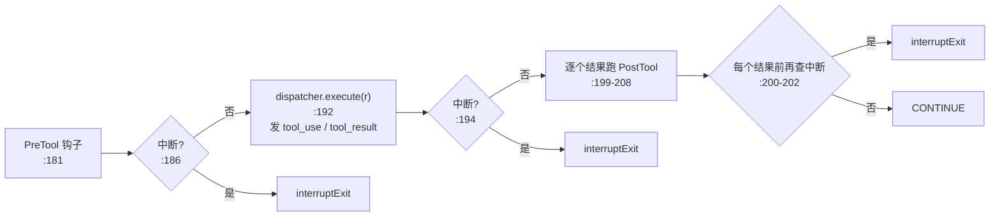
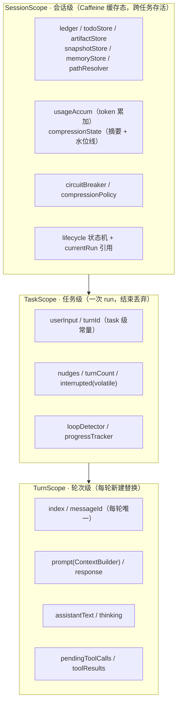
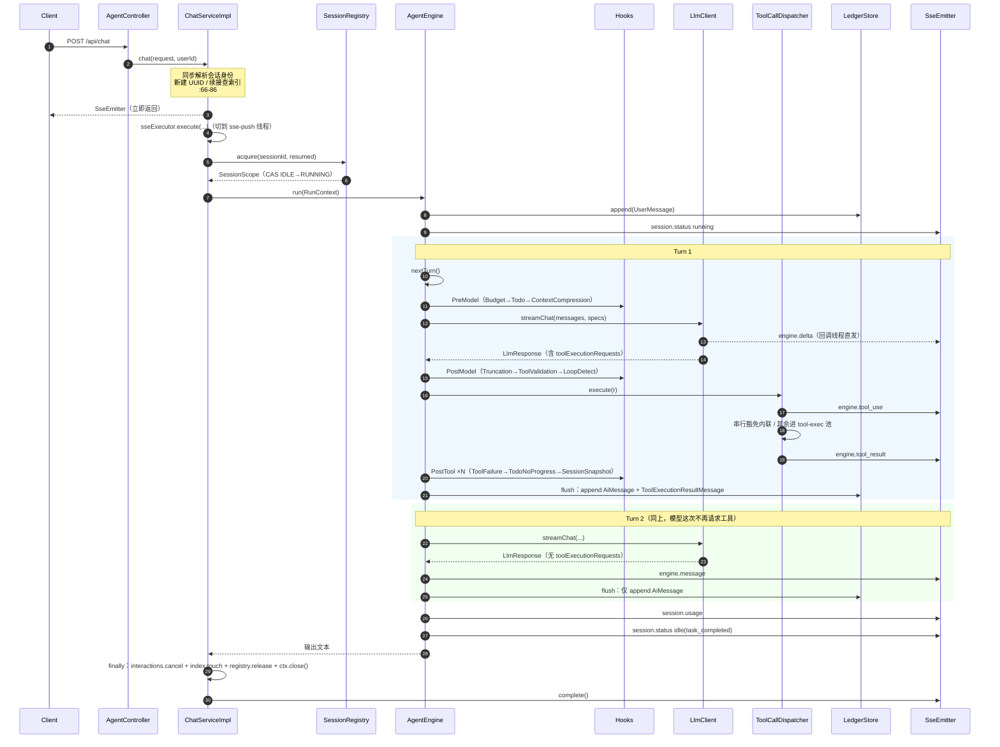

# 01 · 引擎与主循环

> 引擎是**无状态应用级单例**，负责驱动「PreModel → LLM → PostModel → 工具执行 → 消息回填」的循环，直到模型不再请求工具或触发终止条件。所有可变状态都外置在三层作用域里，引擎本身不持有任何会话数据。

## 关键类

| 类 | 路径 | 职责 |
|---|---|---|
| `AgentEngine` | `engine/AgentEngine.java` | 主循环与单轮流水线编排 |
| `LoopAction` | `engine/LoopAction.java` | 循环控制返回值（CONTINUE / SKIP / EXIT） |
| `TurnMessageWriter` | `engine/exec/TurnMessageWriter.java` | 轮末把 AI 消息与工具结果回填账本 |
| `StopHandler` | `engine/stop/StopHandler.java` | 唯一终止漏斗，发终止事件并生成终止文本 |
| `StopCategory` | `engine/stop/StopCategory.java` | 6 类终止原因 + 消息模板 |
| `RunContext` | `runtime/RunContext.java` | 一次 run 的上下文，三层作用域入口 + 事件发射器 |
| `TaskScope` | `runtime/TaskScope.java` | 任务级状态：用户输入、轮次计数、nudges、中断标志、守卫 |
| `TurnScope` | `runtime/TurnScope.java` | 轮次级状态：prompt、response、待执行工具调用、工具结果 |

---

## 1. Task 与 Turn 的界定

这两个概念在代码里混用容易出错，先明确定义：

- **Task（任务）** = 一次 `POST /api/chat` = 一次 `AgentEngine.run(RunContext)` 调用（`engine/AgentEngine.java:76`）。一个 task 拥有一个 `TaskScope` 和一个 `RunContext`。
- **Turn（轮次）** = 主循环的一次迭代 = **一次 LLM 调用 + 该次调用产生的全部工具执行**。

`r.nextTurn()`（`runtime/RunContext.java:49-52`）每轮做的事：

```java
public TurnScope nextTurn() {
    this.turn = new TurnScope(task.incrementTurn());   // 递增计数并整体替换 TurnScope 对象
    return this.turn;
}
```

即**整个 `TurnScope` 对象被替换**，不是复用后清字段。轮次序号从 1 起（`runtime/TaskScope.java:34-36`）。

一个 task 通常包含多个 turn；模型第一次不请求工具时，task 结束。

### 命名陷阱：`turnId` 不是每轮唯一

`TaskScope.turnId` 在**构造时**生成一次（`runtime/TaskScope.java:28`）：

```java
this.turnId = "turn_" + UUID.randomUUID().toString().substring(0, 8);
```

它是 **task 级常量**——整个任务的所有 SSE 事件都携带同一个 `turn_id`。真正的每轮唯一标识是 `TurnScope.messageId`（`runtime/TurnScope.java:30`，`"msg_" + 8位hex`），用于 `engine.message` 和 `session.usage` 事件。读事件流时不要指望靠 `turn_id` 区分轮次。

---

## 2. 外层循环

`engine/AgentEngine.java:76-109`：

```java
public String run(RunContext r) {
    initRun(r);                          // 账本追加原始 UserMessage（:257-259）
    r.emit(SessionStatus.running());     // :80
    while (true) {
        if (r.task().isInterrupted())    → forceTerminate(USER_INTERRUPTED)   // :84-87
        if (turnCount >= maxSteps)       → forceTerminate(MAX_STEPS_REACHED)  // :90-94
        r.nextTurn();                                                         // :96
        try {
            LoopAction action = executeTurn(r);
            if (action.isExit()) return completeExit(r, action.output());     // :99-102
        } catch (Exception e) {
            return completeExit(r, stopHandler.forceTerminate(r, UNEXPECTED_ERROR, ...)); // :103-107
        }
    }
}
```

三个要点：

1. **步数检查在 `nextTurn()` 之前**（`:90` vs `:96`），所以 `maxSteps` 是"最多执行多少轮"的硬上限，不会先建轮再判超。默认 100（`eon.loop.max_steps`）。
2. **token 预算不在这里检查**，而是每轮由 PreModel 阶段的 `BudgetHook` 检查（见 [03-hooks.md](03-hooks.md)）。两者的差别：步数是循环开头的静态闸门，预算是钩子链里的可插拔闸门。
3. **任何逃出 `executeTurn` 的异常**（包括钩子抛出的异常——`HookDispatcher` 没有 try/catch）都被收敛为 `UNEXPECTED_ERROR`。

---

## 3. 单轮八阶段流水线

`engine/AgentEngine.java:115-176`。整个方法体被 `try { ... } finally { messageWriter.flush(r); }` 包住，**回填无条件执行**。



### 阶段 ① 准备上下文（`:118-119`，实现在 `:265-278`）

每轮**新建**一个 `ContextBuilder`，不复用。逐轮重新取值的有：

| 字段 | 来源 | 是否每轮重算 |
|---|---|---|
| `systemPrompt` | `basePrompt`（启动时从 classpath 一次性加载的 String bean） | 否，启动期固定 |
| `summary` | `session().compressionState().getLastSummary()` | 是 |
| `environment` | `EnvironmentContext.of(sessionDir).render()` | 是，**每轮重新渲染**（含当前时间） |
| `memories` | `memoryStore().renderForInjection()` | 是，每轮重读磁盘 |
| `window` | `session().ledger().window()` | 是，取的是活引用 |
| `toolSchemaTokens` | `getSpecifications().size() * 220`（`:50`、`:289-291`） | 是，但为平坦估算 |
| `outputReserveTokens` | `eon.llm.max_tokens` | 否 |
| `contextMaxTokens` | `eon.context.max_tokens` | 否 |

新建的 builder 通过 `r.turn().setPrompt(contextBuilder)` 挂到轮次作用域上，PreModel 钩子由此拿到它做修改（详见 [02-context.md](02-context.md)）。

### 阶段 ② PreModel 钩子与 nudge 消费（`:120`，实现在 `:297-304`）

```java
private LoopAction prepareContext(RunContext r, ContextBuilder contextBuilder) {
    HookResult result = HookDispatcher.dispatchPreModel(hooks.preModel, r);
    if (result.isStop()) return exitOf(r, result);
    consumeNudges(r, contextBuilder);      // ← 紧跟钩子之后
    return LoopAction.CONTINUE;
}
```

`consumeNudges`（`:280-286`）把 `task().nudges()` 用 `\n` 拼接后写入 builder 并清空列表。因为它在 PreModel **之后**立即执行，产生了一个重要的时机差异：

- **PreModel 钩子产生的 nudge → 进入当轮 prompt**（如 `BudgetHook` 的收尾提示）
- **PostModel / PostTool 钩子产生的 nudge → 进入下一轮 prompt**

注意这里只检查 `isStop()`，不检查 `isSkip()`——PreModel 阶段返回 `skip()` 会被静默当作 continue（见 [08-design-gaps.md](08-design-gaps.md) 第 4 条）。

### 阶段 ③④ 组装与调用 LLM（`:126`、`:129-139`）

`contextBuilder.build()` 产出七层消息列表（顺序与内容见 [02-context.md](02-context.md)）。随后按 `llmService.isStreamEnabled()` 分支：

```java
if (llmService.isStreamEnabled()) {
    response = llmService.streamChat(messages, toolService.getSpecifications(),
            delta -> r.emit(AgentDelta.text(r.task().turnId(), delta)),
            delta -> r.emit(AgentDelta.thinking(r.task().turnId(), delta)),
            d -> r.emit(AgentToolDelta.now(...)));
} else {
    response = llmService.chat(messages, toolService.getSpecifications());
}
r.turn().setResponse(response);
r.session().usageAccum().add(response.usage());     // :139 会话级 token 累加
```

流式模式下三个 delta 回调直接发 SSE 事件；注意回调运行在 **HTTP 客户端的回调线程**上，不是 run 线程。响应回来后把 `text`、`thinking`、`toolExecutionRequests()` 分别存入 `TurnScope`（`:141-144`）。

### 阶段 ⑤ PostModel 钩子（`:147-154`）

**先** `setPendingToolCalls(requests)`，**再**触发钩子——顺序不能反，PostModel 钩子（`TruncationHook`/`ToolValidationHook`/`LoopDetectHook`）都要读 `pendingToolCalls`。

这是四个阶段里**唯一处理 `SKIP`** 的地方：

```java
if (postModel.isSkip()) return finishSkip(r);
```

`finishSkip`（`:222-226`）清空 `pendingToolCalls`（避免回填写入孤立 tool_calls）、推进熔断冷却、返回 CONTINUE 进入下一轮。**被 skip 丢弃的调用不会产生任何 tool_result 消息**，模型下一轮只看到 nudge。

### 阶段 ⑥ 正常完成（`:157-160`）

```java
if (requests == null || requests.isEmpty()) {
    r.emit(AgentMessage.now(r.task().turnId(), r.turn().messageId(), text));
    return LoopAction.exit(text);
}
```

这是**唯一的正常完成路径**：模型没有请求工具，即认为任务做完。发出 `engine.message` 事件后携带正文退出。

### 阶段 ⑦ Extension Loop（`:163-166`，实现在 `:178-211`）

工具执行段，内部有 4 个中断检查点：



`ask_question` 工具会**阻塞在 `:192`** 等用户回答（它属于串行豁免清单，在 run 线程内联执行）。`:190-191` 的注释解释了这个设计：阻塞期间用户可能点了停止，所以网关被唤醒后要立即收尾。PostTool 钩子是**逐个工具结果**调用的，不是整批一次，每次调用前再查一次中断（`:199-202`）。

### 阶段 ⑧ 冷却推进与回填（`:169`、`:172-175`）

`r.session().circuitBreaker().tickCooldown()` 每个**完成的**轮次调一次（`finishSkip` 里也调一次，`:224`）。

`finally` 块里的 `messageWriter.flush(r)` 是账本一致性的关键保障——无论本轮走正常完成、skip、钩子 stop、中断还是抛异常，AI 消息都不会丢。

---

## 4. 消息回填与孤立 tool_calls 防护

`engine/exec/TurnMessageWriter.java:23-58`。这里有一个精细的 `null` 语义设计：

`TurnScope.toolResults` 默认是 `null`（`runtime/TurnScope.java:26`），而 `pendingToolCalls` 默认是 `List.of()` 且 setter 把 null 强制转为空列表（`:77-79`）。两者的区别被回填器用来判断"本轮到底派发过工具没有"：

```java
// TurnMessageWriter.java:27-30
// 带 tool_calls 的 AiMessage 必须紧跟对应的工具结果，所以只有真正派发过工具才写 tool_calls；
// 本轮在派发前就退出（PostModel/PreTool 拦截、用户中断）时只留正文，避免账本出现孤立 tool_calls。
boolean dispatched = toolResults != null;
List<ToolExecutionRequest> committedCalls = dispatched ? turn.pendingToolCalls() : List.of();
```

`null` = 从未派发（PostModel/PreTool 拦截、中断）；空列表 = 派发过但零结果。若不做这个区分，被拦截的轮次会往账本写一条带 `tool_calls` 却没有对应 `tool` 行的 AiMessage——这种孤立 tool_calls 在下一轮发给模型时会被多数 LLM 服务商直接拒绝。

回填流程：

1. 无正文且无已执行调用 → 只清临时状态，不写账本（`:35-40`）
2. 构建 `AiMessage`，携带 `text`（有则设）、`toolExecutionRequests`（已派发才设）、`thinking`（有则设，仅用于账本持久化，**不进上下文窗口**）（`:61-74`）
3. `ledger().append(aiMsg, succeeded)` — `succeeded` 是成功调用的 id 集合，供入站管线判定工具结果状态（`:77-86`）
4. 逐条 `ToolExecutionResultMessage` 追加，并带上 `toolResultView` 供前端回放（`:46-52`）
5. 清空 `pendingToolCalls` / `toolResults` / `assistantText` / `thinking`（`:54-57`）

---

## 5. 五类终止条件

| # | 终止条件 | 判定位置 | `StopCategory` | 说明 |
|---|---|---|---|---|
| 1 | 正常完成 | `:157-160` | 无 | 模型未请求工具，`LoopAction.exit(text)` |
| 2 | 用户中断 | `:84-87`、`:186-188`、`:194-196`、`:200-202` | `USER_INTERRUPTED` | 5 个轮询点，协作式 |
| 3 | 达到最大步数 | `:90-94` | `MAX_STEPS_REACHED` | `eon.loop.max_steps`，默认 100 |
| 4 | 钩子请求停止 | 四个阶段的 `exitOf`（`:338-341`） | 由钩子指定 | `BUDGET_EXCEEDED` / `LOOP_DETECTED` / `GATE_REJECTED` / `UNEXPECTED_ERROR` |
| 5 | 未捕获异常 | `:103-107` | `UNEXPECTED_ERROR` | 含 `LlmStalledException` 与钩子抛出的异常 |

### `StopCategory` 与消息模板

`engine/stop/StopCategory.java:10-15`，6 个类别各自带模板：

| 类别 | 模板 |
|---|---|
| `BUDGET_EXCEEDED` | `预算超限: 已用 {0} / {1} tokens` |
| `LOOP_DETECTED` | `检测到死循环: {0}` |
| `GATE_REJECTED` | `门禁拒绝: 破坏性工具 {0} 需要用户审批` |
| `MAX_STEPS_REACHED` | `达到最大步数: {0}` |
| `USER_INTERRUPTED` | `用户主动中断: {0}` |
| `UNEXPECTED_ERROR` | `执行异常: {0}` |

`format(Object... args)`（`:29-35`）把 `{N}` 替换为 `%s` 后 `String.format`；**无参调用时会剥掉末尾的 `": {N}"` 后缀**（`:31`），所以 `USER_INTERRUPTED.format()` 得到的是干净的"用户主动中断"。

### `StopHandler` 是唯一终止漏斗

`engine/stop/StopHandler.java:31-38`：

```java
public String forceTerminate(RunContext r, StopCategory category, String message) {
    log.warn("[停止] {} : {}", category.name(), message);
    r.emit(SessionError.now(message, category.name()));
    r.emit(SessionStatus.terminated(category.name() + ": " + message));
    return "任务终止: " + message + "\n消耗: " + totalTokens + " tokens, " + turnCount + " 轮\n";
}
```

所有强制终止都经过这里，因此客户端一定能看到 `session.error` + `session.status: terminated` 两帧。返回的文本随后流入 `completeExit`。

### `completeExit` 会补发两帧

`engine/AgentEngine.java:232-244`：渲染记忆引用（把 `[[memory:mem_xxx]]` 展开，`:248-251`）→ 发 `session.usage` → 发 `session.status: idle("task_completed")`。

**注意强制终止时客户端会收到两个 status 帧**：先是 `terminated`（StopHandler 发的），紧接着是 `idle(task_completed)`（completeExit 发的）。前端需以 `session.error` 的存在与否判断任务是否真的成功，不能只看最后一个 status。

引擎自身不保存快照——任务结束落盘统一收敛到 `RunContext.close()`（`:246` 注释），由 `ChatServiceImpl.execute` 的 finally 块调用（`api/service/ChatServiceImpl.java:136-138`）。

---

## 6. 中断机制

中断是**协作式轮询**，不使用 `Thread.interrupt()` 打断 run 线程。

标志位是 `TaskScope.interrupted`，一个 `volatile boolean`（`runtime/TaskScope.java:24`）——它是 `TaskScope` 里**唯一被跨线程写入**的字段，其余字段都只由 run 线程操作。

触发路径（`api/service/ChatServiceImpl.java:161-174`）：

```java
public boolean interrupt(String sessionId) {
    return registry.find(sessionId)          // 只读查找，不触发装配
            .map(scope -> {
                RunContext current = scope.currentRun();
                if (current == null) return false;
                current.task().requestInterrupt();
                // 阻塞在提问里的工具线程不会轮询中断标志，必须显式唤醒
                interactions.cancel(sessionId);
                return true;
            })
            .orElse(false);
}
```

两件事必须一起做：设标志 + 唤醒可能阻塞在 `ask_question` 里的线程。后者是因为阻塞在 `CompletableFuture.get()` 上的工具线程根本不会去读 `interrupted` 标志（详见 [04-tools.md](04-tools.md) 的人机交互一节）。

`currentRun` 是 `SessionScope` 上的 `AtomicReference<RunContext>`，在 `RunContext` 构造函数里通过 `session.bindRun(this)` 绑定（`runtime/RunContext.java:33`）。

### 4 个轮询点

全仓库对 `task().isInterrupted()` 的调用共 4 处：

| 位置 | 代码行 | 时机 |
|---|---|---|
| 循环开头 | `:84-87` | 每轮开始前，也是唯一在 `nextTurn()` 之前的检查 |
| PreTool 钩子后 | `:186-188` | 派发工具前 |
| dispatcher 返回后 | `:194-196` | 工具执行完 |
| PostTool 循环内 | `:200-202` | **逐个工具结果**处理前各查一次 |

最后一处在 for 循环体内，所以一批有 N 个工具调用时会被检查 N 次——这是为了让"工具跑完后用户才点停止"的场景尽快收尾，而不是等下一轮开头。

**正在执行的工具不会被强制打断**：dispatcher 的 `future` 从不调用 `cancel(true)`，所以一次已经发出的慢工具调用会跑完，中断只在它返回后生效。派发层也没有超时兜底，见 [08-design-gaps.md](08-design-gaps.md) 第 5 条。

---

## 7. 三层作用域

引擎只认 `RunContext` 一个参数，三层状态从它取：



| 作用域 | 生命周期 | 线程安全约定 |
|---|---|---|
| `SessionScope` | 跨任务，由 Caffeine 缓存管理（idle 30min / running 1440min TTL） | `AtomicReference<SessionLifecycle>` CAS + `ReentrantLock`；见 [06-persistence.md](06-persistence.md) |
| `TaskScope` | 一次 `run()` | 只有 `interrupted` 是 `volatile`（HTTP 线程写）；`nudges` 是普通 `ArrayList`，`turnCount` 是普通 `int`，均假定只由 run 线程操作 |
| `TurnScope` | 一轮循环 | `turn` 字段非 volatile，安全的前提是**只有 run 线程替换它**；并行工具线程只读 `task().turnId()` 和 `turn().pendingToolCalls()`，写入 dispatcher 预分配的结果数组 |

作用域构建位置：`api/service/ChatServiceImpl.java:115-117` 建 `TaskScope` + `RunContext`，`SessionScope` 由 `registry.acquire(sessionId, !created)`（`:111`）从缓存取或装配。

`RunContext` 还是**事件发射器**（`runtime/RunContext.java:55-57`、`:69-80`）：构造时把监听器列表拷成不可变副本，`emit` 逐个调用并**吞掉单个监听器的异常**——一个断开的 SSE 客户端不会杀死整个循环。

---

## 8. 完整任务时序

一次包含 2 轮工具调用的任务：



---

## 9. 并发模型

全阻塞 + 平台线程，**没有 WebFlux，没有虚拟线程，没有响应式流**。

| 线程池 | 定义位置 | 类型 | 用途 |
|---|---|---|---|
| `sse-push` | `config/ExecutorConfig.java:18-25` | `newCachedThreadPool`，daemon | 跑整个 task，run 线程全程阻塞在 LLM 和工具上 |
| `tool-exec` | `engine/exec/ToolCallDispatcher.java:49-55` | `newFixedThreadPool(eon.tools.parallelism)`，daemon，默认 4 | 跑非串行豁免的工具 |

`SseEmitter` 的超时设为 `eon.interaction.sse_timeout_seconds`（默认 1800s），`api/service/ChatServiceImpl.java:88-89` 的注释说明了原因：一次 run 里可能多次阻塞等用户回答，超时必须覆盖「执行 + 等待」，不能沿用 Spring 默认的 5 分钟。

---

## 相关篇章

- [02-context.md](02-context.md) — 阶段 ①③ 展开：七层组装、token 口径、压缩流水线
- [03-hooks.md](03-hooks.md) — 四阶段钩子 SPI、10 个具体钩子、守卫子系统
- [04-tools.md](04-tools.md) — 阶段 ⑦ 展开：派发、参数处理、MCP、人机交互
- [05-events-api.md](05-events-api.md) — 本篇时序图里所有 SSE 事件的载荷定义
- [06-persistence.md](06-persistence.md) — `SessionScope` 的缓存与生命周期、账本回填的落盘细节
- [08-design-gaps.md](08-design-gaps.md) — `skip()` 语义不统一、派发层无超时等已验证缺口
