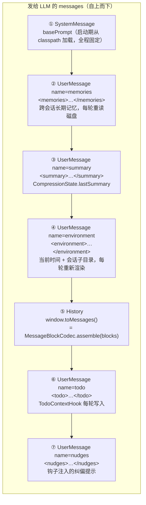
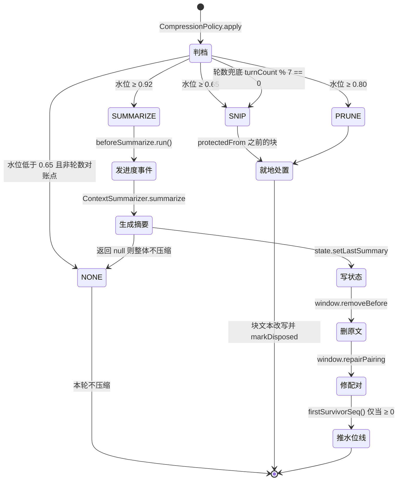

# 02 · 上下文管理

> 上下文管理负责把「账本里的原始消息」变成「本轮发给 LLM 的分层 messages」，并在窗口逼近上限时用三档压缩守住 token 预算。核心设计是**磁盘无损 / 内存有损**：账本永远保存原始消息，压缩只作用于内存窗口视图。

## 关键类

| 类 | 路径 | 职责 |
|---|---|---|
| `ContextBuilder` | `context/ContextBuilder.java` | 七层组装 + token 度量，**每轮新建** |
| `ContextWindow` | `context/ContextWindow.java` | 有序块列表，尾部保护区与配对不变式 |
| `ContextBlock` | `context/block/ContextBlock.java` | 压缩的最小单位，身份不可变 + 文本可改写 |
| `BlockKind` / `CompressionLevel` | `context/block/` | 块类型四值 / 压缩档位四档 |
| `MessageBlockCodec` | `context/block/MessageBlockCodec.java` | `ChatMessage` ⇄ `ContextBlock` 双向投射 |
| `IngestPipeline` | `context/pipeline/IngestPipeline.java` | 入站唯一关卡：格式化 + 大结果落盘 |
| `CompressionPolicy` | `context/policy/CompressionPolicy.java` | 压缩编排：判档 → 处置 → 修复配对 |
| `CompressionSettings` | `context/policy/CompressionSettings.java` | 压缩参数快照（record） |
| `ContentCompressor` | `context/ContentCompressor.java` | `headTail` 文本截断 + `skeleton` JSON 骨架化 |
| `ContextSummarizer` | `context/summary/ContextSummarizer.java` | 调 LLM 生成结构化摘要 |
| `CompressionState` | `context/CompressionState.java` | 只有两个字段：`lastSummary` + `replayFromSeq` |
| `ContextMetrics` | `context/ContextMetrics.java` | 水位与构成分解 |
| `EnvironmentContext` | `context/dynamic/EnvironmentContext.java` | 每轮实时渲染的时间与目录信息 |
| `ContextCompressionHook` | `engine/hook/premodel/ContextCompressionHook.java` | 压缩的唯一触发点（PreModel, order=100） |
| `LedgerStore` | `store/ledger/LedgerStore.java` | JSONL 账本 + 内存窗口，`messageSeq` 唯一发放者 |

---

## 1. ContextBlock 模型

压缩的最小单位不是消息，而是**块**。一条 `AiMessage` 会被拆成多个块，这样才能对正文和工具参数施加不同力度的处置。

### `BlockKind`（`context/block/BlockKind.java:6-19`）

| 值 | 来源 |
|---|---|
| `USER_INPUT` | 用户消息 |
| `AI_TEXT` | 模型输出的正文 |
| `TOOL_ARGS` | 模型输出的工具调用参数，**一个 `ToolExecutionRequest` 一块** |
| `TOOL_RESULT` | 工具执行结果 |

`SystemMessage` 不产生任何块（`MessageBlockCodec.explode:65` 直接落到末尾返回空列表）。

### `CompressionLevel`（`context/block/CompressionLevel.java:6-40`）

按 `severity` 排序的四档，**每轮至多命中一个档位**（`:4` 类注释）：

| 档位 | severity | 语义 |
|---|---|---|
| `NONE` | 0 | 不处置 |
| `SNIP` | 1 | 头尾保留截断 |
| `PRUNE` | 2 | 清空内容替换为占位文本，**仅对磁盘上有副本的块执行** |
| `SUMMARIZE` | 3 | 由 LLM 生成摘要后删除原文 |

三个辅助方法：`enabled()`（≠NONE）、`atLeast(other)`（`:32-34`）、`higherOf(other)`（`:37-39`）。后两者是块级单调性的基础。

### 块的身份与处置属性（`context/block/ContextBlock.java:11-30`）

**不可变身份**（构造时确定）：

| 字段 | 含义 |
|---|---|
| `id` | `groupId + "#" + ordinal`（`MessageBlockCodec.java:143-151`） |
| `kind` | `BlockKind` |
| `groupId` | 来源消息组，`"g" + messageSeq`（`MessageBlockCodec.java:23`） |
| `ordinal` | 组内序号，`assemble` 时据此排序还原 |
| `messageSeq` | 来源消息在 JSONL 账本中的行号，**水位线的依据** |
| `toolName` / `toolCallId` | 仅 TOOL_ARGS / TOOL_RESULT，`toolCallId` 是配对键 |
| `originalChars` | 入站时的原文长度，构造函数里从 `text.length()` 捕获（`:41`） |

**可变处置状态**：

| 字段 | 含义 |
|---|---|
| `text` | 可就地改写（`:87-89`） |
| `spilled` | 内容已落盘，可安全清空（`:27`） |
| `disposedLevel` | 已施加的最高档位，**单调不回落**（`:122-124`） |

`disposedAtOrAbove(level)`（`:117-119`）是防重复处置的判据；`markDisposed` 用 `higherOf` 保证只升不降——高档位可以重新处置低档位处理过的块，反之不行。

---

## 2. MessageBlockCodec：双向投射

### `explode(msg, messageSeq)`（`context/block/MessageBlockCodec.java:22-66`）

| 输入 | 产出 |
|---|---|
| `UserMessage` | 1 × `USER_INPUT`（取 `um.singleText()`） |
| `AiMessage` | `AI_TEXT`（正文非空白才有）+ N × `TOOL_ARGS`（每个 `ToolExecutionRequest` 一块，text = `req.arguments()`） |
| `AiMessage`（全空） | 仍产出 1 × `AI_TEXT`（`:49-53` 兜底，避免消息在窗口里凭空消失） |
| `ToolExecutionResultMessage` | 1 × `TOOL_RESULT` |
| `SystemMessage` | 无（`:65` 返回空列表） |

**`thinking` 不进窗口**：`explode` 完全没有读 `am.thinking()`。它虽然被 `LedgerStore.SerializedMessage` 持久化（`store/ledger/LedgerStore.java:138` 注释「AI 消息的 thinking（推理链），不进入上下文窗口」）并回放给前端，但**永不进入发给 LLM 的上下文**。

### `assemble(blocks)`（`:71-126`）

按 `groupId` 归并进 `LinkedHashMap`（保留插入顺序）→ 组内按 `ordinal` 升序 → `assembleGroup` 还原：

| 组首块类型 | 还原为 |
|---|---|
| `USER_INPUT` | `UserMessage.from(wrap("user_input", joinedText))` — **用户原文被重新包上 `<user_input>` 标签**（`:91-93`），与 `src/main/resources/prompts/system_prompt.md` 里的约定对应 |
| `TOOL_RESULT` | `ToolExecutionResultMessage.from(callId, toolName ?? "unknown", joinedText)` |
| `AI_TEXT` / `TOOL_ARGS` | 合并回一条 `AiMessage`：多个 AI_TEXT 用 `\n` 连接，每个 TOOL_ARGS 重建为 `ToolExecutionRequest`（`:100-121`） |

`:115` 的注释点出了一个约束：**处置后的 arguments 必须是合法 JSON**。这就是为什么 `TOOL_ARGS` 块不能用 `headTail` 截断（截断会产生残缺 JSON），只能用 `skeleton()` 做字段级替换。

---

## 3. 七层组装

`ContextBuilder.build()`（`context/ContextBuilder.java:90-117`）产出的最终 `List<ChatMessage>`：



三个关键性质：

1. **每个锚点层都是「命名 UserMessage」**：`UserMessage.from(name, wrap(label, content))`，`wrap` 用 XML 标签包裹（`:120-122`）。name 与标签名一致。
2. **锚点层从不落账本**：只有真实对话（用户输入、AI 消息、工具结果）通过 `LedgerStore.append` 持久化。锚点每轮由 `AgentEngine.buildContext` 重新拼装（`engine/AgentEngine.java:265-278`）。
3. **null/空白层被跳过**（每层前都有 `!= null && !isBlank()` 判断），所以首个任务没有 summary 时第 ③ 层根本不存在。

History 层的数据源是 `session().ledger().window()` 的**活引用**（`ContextBuilder.java:60-62`、`:69-71`），不是快照——这意味着 PreModel 阶段的压缩会立刻反映到本轮的 `build()` 结果里。

### `EnvironmentContext`（`context/dynamic/EnvironmentContext.java`）

`render()`（`:31-43`）输出 `当前时间: yyyy年M月d日 EEEE H:mm` + 每条 extra 一行。工厂 `of(sessionDir)`（`:48-67`）遍历 `scripts`/`download`/`upload`/`skills`/`tool-results` 五个子目录，**只注入实际存在的**，标签分别是 脚本目录/工作目录/上传目录/技能目录/工具结果目录。

因为每轮重新渲染，模型在长任务中能看到时间流逝，也能看到工具刚创建的目录。

---

## 4. token 口径

`ContextBuilder.metrics()`（`:125-139`）+ `ContextMetrics`（`context/ContextMetrics.java`）：

```
sentTokens  = historyMsgTokens + anchorTokens + toolSchemaTokens + outputReserveTokens   (:43-45)
waterLevel  = min(1.0, sentTokens / contextMaxTokens)                                    (:37-40)
```

| 分量 | 计算方式 | 代码位置 |
|---|---|---|
| `historyMsgTokens` | 逐块估算后求和，同时按 `BlockKind` 分类记入 `tokensByKind`（`EnumMap`） | `ContextBuilder.java:142-150` |
| `anchorTokens` | system + summary + environment + memories + todo + nudges 六项估算之和 | `ContextBuilder.java:152-161` |
| `toolSchemaTokens` | **平坦估算：工具数 × 220** | `AgentEngine.java:50`、`:289-291` |
| `outputReserveTokens` | `eon.llm.max_tokens`（默认 12000） | `AgentEngine.java:275` |
| `contextMaxTokens` | `eon.context.max_tokens`（默认 200000） | `AgentEngine.java:276` |

两点需要知道：

- **水位包含了 12K 的输出预留和工具 schema 估算**。所以水位 65% 并不等于历史消息占了 65%，而是「本轮真实要发的总量」占了 65%。
- 估算器是 `OpenAiTokenCountEstimator("gpt-4o")`（`config/AgentBeans.java:147-150`），而聊天模型是 `mimo-v2.5`——这是**有意的近似**。无估算器时退化为 `text.length() / 2`（`ContextBuilder.java:168`）。

`composition()`（`ContextMetrics.java:48-64`）产出可读的 `KIND 45% | KIND 30%…` 占比串，按占比降序。**目前无任何调用方**，度量也未经 SSE 或 REST 暴露，仅水位判定与压缩前后日志内部消费（见 [08-design-gaps.md](08-design-gaps.md) 第 6 条）。

---

## 5. 两套独立的体积防线

`src/main/resources/application.yml:46-49` 明确注明这是「两套独立机制」：

| | 入站落盘（Spill） | 水位压缩（Compression） |
|---|---|---|
| 触发时机 | 消息进入账本时，**一次性** | 每轮 PreModel，**反复** |
| 触发判据 | 单条工具结果的**字符数** > 12000 | 整窗的 **token 水位** ≥ 阈值 |
| 作用对象 | 单个 `TOOL_RESULT` 块 | 保护区之前的全部块 |
| 实现位置 | `context/pipeline/IngestPipeline.java:76-99` | `context/policy/CompressionPolicy.java` |
| 原文去向 | `ArtifactStore` → `artifact://` 引用，可用 `read_file` 取回 | SNIP/PRUNE 丢弃中段；SUMMARIZE 转成摘要 |

两者互补：Spill 防的是「单条结果过大」，Compression 防的是「历史累积过多」。一个块可能先被 Spill 截断（`spilled=true`），后续再被 PRUNE 清空——正是 `spilled` 标志让 PRUNE 敢把它清成占位文本。

---

## 6. 入站管线

`IngestPipeline` 是「所有内容进入上下文的唯一关卡」（`:17` 类注释）。`LedgerStore.append`（实时）与 `LedgerStore.loadAll`（回放）走的是**同一条管线**（`store/ledger/LedgerStore.java:57`、`:114`），这是回放能确定性重现窗口状态的前提。

`ingest(msg, succeededToolCalls, messageSeq)`（`:42-57`）：`explode` 成块 → 对每个 `TOOL_RESULT` 块二选一：

### 未超阈值：套展示外壳（`:64-71`）

```
[Tool result] {toolName}
├─ 状态: 成功/失败
└─ 内容:
{text}
```

成功与否由 `toolCallId` 是否在 `succeededToolCalls` 集合里决定（`:46-48`）——该集合由 `TurnMessageWriter.succeededIds` 从工具执行记录里提取（`engine/exec/TurnMessageWriter.java:77-86`）。

### 超阈值：落盘（`:76-99`）

1. `compressor.headTail(raw, spillKeepChars=8000)` 生成头尾摘要
2. `artifactStore.save(toolName, raw, messageSeq)` 写入完整原文
3. **落盘失败（返回 null）则降级**：记 WARN、走普通 `formatResult`、**保留原文入窗**（`:81-85`）——宁可多占 token 也不丢内容
4. 成功则 `setSpilled(true)` 并替换块文本：

```
[Tool result] {toolName}
├─ 状态: 成功/失败
├─ 内容:
{头尾摘要}
├─ 截断提示: 内容过大（N 字符），已截断为 M 字符摘要
└─ 元数据: 完整内容已保存至 artifact://{refId}，可用 read_file 工具读取该引用获取完整内容
```

最后一行是给模型的**逃生通道**：`ReadFileTool` 接受 `artifact://` 前缀的目标（见 [04-tools.md](04-tools.md)），所以被落盘的内容随时可以按需取回。

**用户消息与 AI 消息在入站阶段不做任何变换或截断**，只有工具结果被处理。它们的体积控制全部延后到水位压缩阶段。

---

## 7. 压缩全流程

唯一触发点是 `ContextCompressionHook.beforeModelCall`（`engine/hook/premodel/ContextCompressionHook.java:30-54`）：窗口为空直接 `stop(UNEXPECTED_ERROR, "上下文为空")`（`:32-35`）；否则算 `before = prompt().metrics()`，调 `CompressionPolicy.apply(...)`，其中 `beforeSummarize` 回调发一个 `engine.hook` SSE 事件（`:42`），让前端知道正在做一次静默的额外 LLM 调用。若命中了档位，把新摘要写回 `prompt().setSummary(...)`（`:47`）并记一条水位前后对比日志（`:50-51`）。



> 水位三档**自上而下命中即返回**，所以 ≥0.92 时只会走 SUMMARIZE 而不会先 SNIP 再升级。轮数兜底只在水位三档全部未命中时才生效。

### 档位判定（`context/policy/CompressionPolicy.java:80-92`）

**水位三档自上而下，命中即返回；均未命中时轮数兜底**：

```java
double water = metrics.waterLevel();
if (water >= settings.summarizeWaterLevel()) return SUMMARIZE;   // 0.92
if (water >= settings.pruneWaterLevel())     return PRUNE;       // 0.80
if (water >= settings.snipWaterLevel())      return SNIP;        // 0.65
if (turnCount > 0 && turnCount % settings.turnInterval() == 0)   // 每 7 轮
    return settings.turnLevel();                                 // SNIP
return NONE;
```

轮数兜底的意义：即使水位一直不高，每 7 轮也会做一次 SNIP 对账，防止大量中等长度的块长期堆积。

### 尾部保护区

`protectedFrom = max(0, size - tailGuardBlocks)`（`context/ContextWindow.java:51-53`），默认 `tailGuardBlocks = 12`。**最后 12 个块在任何档位下都不被处置**，也不会被 SUMMARIZE 删除。这保证了最近的对话细节始终以原文形式在场。

### 分块处置矩阵（`:100-152`）

`dispose` 遍历 `[0, min(protectedFrom, size))`，跳过 `disposedAtOrAbove(level)` 的块，再跳过「替换文本为 null 或不严格变短」的块（`:107-110`——防止越压越长），然后 `setText` + `markDisposed`。

| 块类型 | SNIP | PRUNE | SUMMARIZE | 说明 |
|---|---|---|---|---|
| `TOOL_RESULT` | 头尾截断至 4000 字符 | 已 `spilled` → `[旧工具结果内容已清除]`；未落盘 → 头尾截断 | 删除（转摘要） | `:137-142` |
| `TOOL_ARGS` | 不动 | 仅当 > 2000 字符 → `skeleton()` JSON 骨架化 | 删除（转摘要） | `:148-152`；短参数裁剪后反而更长，故有下限 |
| `AI_TEXT` | 头尾截断至 4000 字符 | **不动** | 删除（转摘要） | `:124-128`，注释：「推理链被清空比被截断更伤，截断至少保住开头的问题分析与结尾的结论」 |
| `USER_INPUT` | **不动** | **不动** | 删除（转摘要） | `:129-130`，注释：「用户消息只有『原文保留』与『被摘要吸收后删除』两个状态」 |

`USER_INPUT` 的特殊地位是整个压缩设计的支点：用户原话一旦要丢，必须先被摘要**逐字吸收**（见第 8 节的 prompt 约束），绝不做就地截断。

### SUMMARIZE 分支的顺序（`:50-65`）

顺序有严格依赖，不能调换：

1. `beforeSummarize.run()` — 发进度事件
2. `summarizer.summarize(window, protectedFrom, state.getLastSummary(), ledgerPath)` — 返回 null 则整体降级为 `NONE`
3. `state.setLastSummary(summary)` — **先存摘要**
4. `window.removeBefore(protectedFrom)` — **再删原文**（`ContextWindow.java:61-69`）
5. `window.repairPairing()` — 修复配对（`:81-122`）
6. `replayFrom = window.firstSurvivorSeq()`，**仅当 ≥ 0 时**才 `state.setReplayFromSeq(replayFrom)`

第 3、4 步的顺序保证「摘要丢了就不会删原文」。第 5、6 步的顺序由 `ContextWindow.java:58-59` 的注释说明：`removeBefore` 的返回值可能被 `repairPairing` 改变（它可能丢弃首块孤立 TOOL_RESULT），所以水位线必须在修复之后取。第 6 步的 `>= 0` 判断对应 `:61` 注释：窗口清空时返回 -1，此时**保留旧水位线**而不是写成 -1。

### `repairPairing` 的两个动作（`ContextWindow.java:81-122`）

先预扫描收集所有 `TOOL_ARGS` 的 callId 和所有 `TOOL_RESULT` 的 callId，再逐块过滤：

- **丢弃孤立结果**：`TOOL_RESULT` 的 callId 在窗口里找不到对应的 `TOOL_ARGS` → 跳过（`:97-103`）
- **补合成结果**：`TOOL_ARGS` 的 callId 没有对应的 `TOOL_RESULT` → 紧跟其后插入一块合成结果，文本 `[合成] 工具结果缺失，请重新调用此工具获取最新结果`，id 加 `#synthetic` 后缀、groupId 加 `#syn-{callId}` 后缀（`:106-117`）

这个不变式是硬性的：带 `tool_calls` 的 AiMessage 后面必须跟齐对应的工具结果，否则 LLM 服务端会直接拒绝请求。删除窗口头部很容易切断配对，所以每次 SUMMARIZE 后都要修一遍。

---

## 8. ContextSummarizer

`context/summary/ContextSummarizer.java`。应用级单例，会话数据全部由参数传入（`:28` 注释）。

### 它确实会调 LLM

`llmService.complete(messages)`（`:217`），在 `llm/LlmClient.java` 里等价于 `chat(messages, null)`——**用的是同一个主聊天模型**（`mimo-v2.5`），同步、不带工具、走标准的指数退避重试。所以一次 SUMMARIZE 会让用户看到一段"卡住"的静默期，这正是 `engine.hook` 事件存在的理由。

### 分段策略（`:94-121`）

`collectRemovable` 取 `[0, protectedFrom)` 的块（`:77-85`，注释强调「筛选条件必须与 removeBefore 一致」），`segment` 按 `maxInputChars=80000` 切段：

- 单块超过预算 → **独占一段**（通常是工具结果，`:104-112`）
- 普通块累积到预算上限后切段（`:113-116`）
- 每块加角色标记前缀（`:127-134`）：`[USER]` / `[AI]` / `[TOOL:工具名]` / `[RESULT:工具名]`

### 摘要 prompt（`:154-210`）

硬编码的中文模板，要求严格的四段结构：

1. **User Requests** — 每轮问答一个条目，`<user_input>` 标签内**逐字照抄用户原文**，标 `[已完成]` / `[进行中]`，附「结论」与「关键事实」
2. **Key Context and Decisions**
3. **User Preferences and Updates**
4. **Pending Tasks and Current Work**

几条决定性的约束：

- `:170-174` — 历史问答与最新问答一视同仁逐条列出；「用户消息原文会从上下文删除，这里是后续了解用户诉求的唯一依据」；绝不因两次提问相似就合并
- `:175` — **「旧摘要里已存在的条目原样保留、只增不删」**，这是滚动合并不丢信息的 prompt 层保证
- `:179` — 第 2~4 段**只覆盖最新一次问答**
- `:181-183` — 旧的第 2~4 段若描述的是更早提问，要压缩成结论并入第 1 段作历史条目，第 2~4 段改写为最新问答
- `:191-193` — 容量不够时从**最早**的历史条目开始降级，最新问答与第 2~4 段始终完整
- 输出上限 `maxOutputChars=12000`

System message 是 `你是一个对话摘要生成器。请严格按指令生成摘要。`（`:213`）。

### 迭代合并与兜底（`:50-72`）

多段时**上一段的结果作为下一段的 `existingSummary` 输入**，形成滚动合并。某段失败（LLM 异常或返回空白）则跳过并记 WARN；**全部失败**才走 `fallback()`：有旧摘要就保留旧摘要，否则写 `[摘要失败] 历史对话摘要生成失败，完整对话记录: {ledgerPath}`。

### `summarize_max_output_chars` 的隐藏约束

`src/main/resources/application.yml:43-45` 的注释值得原文引用：

> 必须 ≤ `eon.llm.max_tokens`：超出则模型吐不完被截断，而 `complete()` 丢弃 finishReason 不感知截断，残缺摘要会被当成有效结果存下来并在下一轮继续被压

即这个值配错会导致**静默的信息腐蚀**，且会自我放大（残缺摘要成为下一轮的旧摘要输入）。

### 摘要存到哪

`CompressionState.lastSummary`（`context/CompressionState.java:5`）→ 挂在 `SessionScope` 上跨任务存活 → 由 `SessionSnapshotStore` 写入 `state.json` → 每轮被 `AgentEngine.buildContext` 取出注入 `<summary>` 锚点层。它**替换**原文的方式是物理删除：`window.removeBefore(protectedFrom)`。

---

## 9. ContentCompressor 的两种手法

`context/ContentCompressor.java:11` 类注释：「headTail 面向普通文本，skeleton 面向工具参数 JSON」。

### `headTail(content, keepChars)`（`:32-44`）

保留头 `keepChars/2` 字符 + 尾 `keepChars - headChars` 字符，中间用 `"\n...\n"` 连接。已经放得下就原样返回。

| 调用场景 | keepChars | 实际效果 |
|---|---|---|
| SNIP 档处置 TOOL_RESULT / AI_TEXT | 4000（`snip_keep_chars`） | ~2000 头 + ~2000 尾 |
| 入站落盘的摘要 | 8000（`spill_keep_chars`） | ~4000 头 + ~4000 尾 |

**没有按工具区分的限额**，唯一的工具特化行为是 JSON 骨架化。

### `skeleton(json)`（`:56-82`）

把工具调用参数解析成扁平 `Map<String,Object>`，遍历**顶层**字段：字符串且长度 > `LONG_FIELD_CHARS=200` → 替换为 `"<N 字符已裁剪，原文不在上下文中>"`；其余字段与结构原样保留。

返回 `null`（语义是「不要动这个块」）的三种情况：解析不出 map（`:58-60`）、没有任何长字段（`:73-75`）、重新序列化失败（`:79-81`）。`CompressionPolicy.dispose` 把 null 当作"跳过"处理（`:110`）。

只处理顶层字段是有意的——嵌套结构里的长字符串通常是有意义的载荷，粗暴裁剪会破坏 JSON 语义。

---

## 10. 防重复压缩的四道机制

长任务里压缩每轮都在跑，如果不做幂等保护，同一段内容会被反复截断直至面目全非。四道防线：

| # | 机制 | 位置 |
|---|---|---|
| 1 | **块级单调档位** — `disposedAtOrAbove(level)` 跳过已处置块；`markDisposed` 用 `higherOf` 只升不降；再加「替换文本必须严格变短」校验 | `ContextBlock.java:117-124`、`CompressionPolicy.java:107-110` |
| 2 | **水位线推进** — SUMMARIZE 物理删除块并把 `replayFromSeq` 推到首个幸存块的 `messageSeq`；会话恢复时账本只从水位线之后回放，被摘要的消息**永不再入窗** | `CompressionPolicy.java:60-64`、`LedgerStore.java:93-124` |
| 3 | **摘要 prompt 层只增不删** — 「旧摘要里已存在的条目原样保留、只增不删」 | `ContextSummarizer.java:175` |
| 4 | **落盘幂等** — artifact 文件名由 `messageSeq` 确定性派生，回放与实时落盘写同一路径，重复落盘即幂等覆盖 | `store/artifact/ArtifactStore.java` |

第 1 条有个细节：高档位**可以**重新处置低档位处理过的块（`atLeast` 是 ≥ 而非 ==），所以一个先被 SNIP 截断的 TOOL_RESULT，在 PRUNE 档且已落盘时仍会被清空成占位文本。这是期望行为——力度升级本来就该生效。

---

## 11. 数据流全景

```
用户输入 / AI 消息 / 工具结果（原始）
        │
        ▼
LedgerStore.append(msg, succeededToolCalls[, view])     ← synchronized，唯一 messageSeq 发放者
        │
        ├─▶ IngestPipeline.ingest(msg, succeeded, seq)  ← 入站关卡
        │       ├─ MessageBlockCodec.explode → ContextBlock[]
        │       └─ TOOL_RESULT：>12000 字符 → spillArtifact；否则 formatResult
        │
        ├─▶ ContextWindow.addAll(blocks)                ← 内存有损视图（压缩作用于此）
        │
        └─▶ ledger.jsonl 追加一行原始消息               ← 磁盘无损，永不重写
        
每轮 PreModel：
        ContextBuilder（新建）
          ├─ setWindow(live 引用)
          ├─ setSummary / setEnvironment / setMemories（每轮重算）
          └─ ContextCompressionHook → CompressionPolicy.apply(window, metrics, state, ...)
                                        ├─ SNIP / PRUNE：就地改写块文本
                                        └─ SUMMARIZE：LLM 摘要 → 删头 → 修配对 → 推水位线
        ContextBuilder.build() → 七层 List<ChatMessage> → LLM
```

---

## 相关篇章

- [01-engine.md](01-engine.md) — 阶段 ①②③ 的调用时机、`buildContext` 每轮新建的完整字段表
- [03-hooks.md](03-hooks.md) — `ContextCompressionHook` 在 PreModel 链里的位置（order=100，排在 Budget 与 Todo 之后，所以算水位时 todo 锚点已就位）
- [04-tools.md](04-tools.md) — `artifact://` 引用的取回路径、各工具自身的输出截断
- [06-persistence.md](06-persistence.md) — 账本/快照/artifact 的磁盘布局、`replayFromSeq` 如何决定 RESUME 还是 LOAD
- [07-configuration.md](07-configuration.md) — `eon.context.*` 全部键与耦合约束
- [08-design-gaps.md](08-design-gaps.md) — `composition()` 无调用方、度量不可观测
