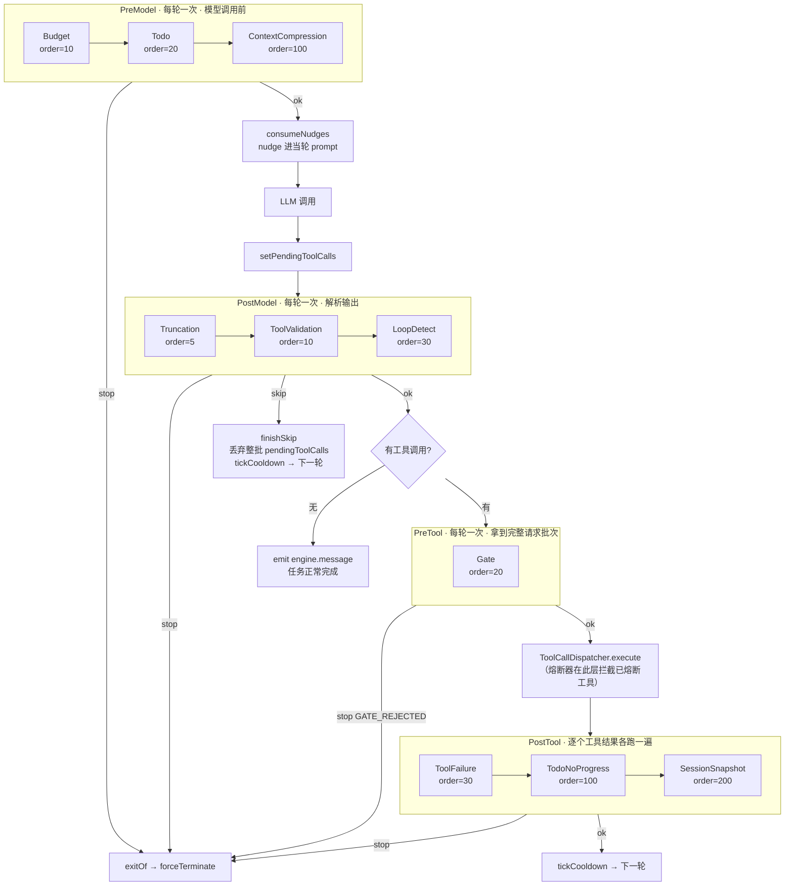

# 03 · 四阶段钩子

> 钩子是把「循环控制策略」从引擎主体里剥离出来的扩展点。引擎只负责在四个固定位置调用钩子链并解释返回值，所有具体策略（预算、循环检测、门禁、压缩、快照）都是可插拔的 `@Component` 单例。

## 关键类

| 类 | 路径 | 职责 |
|---|---|---|
| `Hook` | `engine/hook/Hook.java` | SPI 基础接口 + 四个阶段嵌套接口 |
| `HookResult` | `engine/hook/HookResult.java` | 三态返回值：ok / skip / stop |
| `HookDispatcher` | `engine/hook/HookDispatcher.java` | 四个静态派发方法，短路语义 |
| `LoopDetector` | `engine/guard/LoopDetector.java` | 同工具同参数重复计数（task 级） |
| `ProgressTracker` | `engine/guard/ProgressTracker.java` | Todo 快照滑窗无进展检测（task 级） |
| `ToolCircuitBreaker` | `engine/guard/ToolCircuitBreaker.java` | 单工具连续失败熔断（**session 级**） |

---

## 1. Hook SPI

`engine/hook/Hook.java:14-48`：

```java
public interface Hook {
    String name();                                        // 用于日志
    default boolean active(RunContext r) { return true; } // 是否激活
    default int order() { return 100; }                   // 阶段内顺序，小者先

    interface PreModelHook  extends Hook { HookResult beforeModelCall(RunContext r); }
    interface PostModelHook extends Hook { HookResult afterModelCall(RunContext r); }
    interface PreToolHook   extends Hook { HookResult beforeToolExecution(RunContext r, List<ToolExecutionRequest> requests); }
    interface PostToolHook  extends Hook { HookResult afterToolExecution(RunContext r, String toolName, boolean success); }
}
```

### 没有 phase 枚举

阶段归属由**实现了哪个嵌套接口**表达，不是靠枚举字段或注解。一个钩子只属于一个阶段。这样做的好处是编译期就能保证签名正确（`PreToolHook` 必然能拿到 `requests`，`PostToolHook` 必然能拿到 `toolName` 和 `success`），代价是分桶只能靠 `instanceof` 判断（见第 2 节）。

### 无状态约束

`Hook.java:10-12` 的类注释是硬性契约：

> Hook 不含可变状态，可安全作为应用级单例被多会话共享。跨轮累计的状态外置到 TaskScope/SessionScope。

所有 10 个钩子都遵守了这一点：`LoopDetectHook` 的计数存在 `TaskScope.loopDetector`，`ToolFailureHook` 的计数存在 `SessionScope.circuitBreaker`。钩子字段里只有注入的配置与依赖。

---

## 2. 发现、分组与排序

**发现**：Spring 组件扫描。`AgentEngine` 构造函数注入 `List<Hook> allHooks`（`engine/AgentEngine.java:56`），拿到容器里所有实现了 `Hook` 的 bean。

**分组**：`groupHooks`（`engine/AgentEngine.java:348-371`）用 `instanceof` 的 **if/else 链**分桶：

```java
for (Hook hook : hooks) {
    if (hook instanceof Hook.PreModelHook h)       preModel.add(h);
    else if (hook instanceof Hook.PostModelHook h) postModel.add(h);
    else if (hook instanceof Hook.PreToolHook h)   preTool.add(h);
    else if (hook instanceof Hook.PostToolHook h)  postTool.add(h);
}
```

因为是 `else if`，**一个同时实现两个阶段接口的 bean 只会注册进第一个匹配的桶**，优先级为 PreModel > PostModel > PreTool > PostTool，且不会有任何警告。当前 10 个钩子都只实现一个接口，所以这个行为尚未造成问题，但它是 SPI 的一个隐含约束。

**排序**：四个桶各自按 `order()` 升序（`:365-368`）。

**时机**：分组与排序在 `AgentEngine` **构造期一次性完成**，结果存进 `HookBuckets` record（`:374-380`）。运行期不做任何反射或重新排序。

---

## 3. 调度语义

`engine/hook/HookDispatcher.java` 是四个同构的静态方法。以 PreModel 为例（`:14-25`）：

```java
public static HookResult dispatchPreModel(List<Hook.PreModelHook> hooks, RunContext r) {
    for (Hook.PreModelHook hook : hooks) {
        if (!hook.active(r)) continue;
        HookResult result = hook.beforeModelCall(r);
        if (result.isSkip() || result.isStop()) return result;   // 短路
    }
    return HookResult.ok();
}
```

三个性质：

1. **短路返回**：遇到第一个 skip 或 stop 立即返回，后面的钩子不再执行。
2. **四个阶段都会短路 skip**：`isSkip() || isStop()` 的判断在四个方法里完全一致（`:20`、`:34`、`:49`、`:64`）。但**引擎对 skip 的处理只在 PostModel 阶段存在**——见下一节。
3. **没有 try/catch**：钩子抛出的异常直接冒泡到 `executeTurn`，再被 `run()` 的兜底 catch 收敛为 `UNEXPECTED_ERROR`（`engine/AgentEngine.java:103-107`）。一个有 bug 的钩子会终止整个任务。

### `PostTool` 的调用粒度不同

其他三个阶段每轮各调一次；`dispatchPostTool` 是**逐个工具结果调用**的（`engine/AgentEngine.java:199-208`）：

```java
for (int i = 0; i < requests.size(); i++) {
    if (r.task().isInterrupted()) return interruptExit(r);
    ToolCallRecord result = results.get(i);
    LoopAction postTool = firePostToolHooks(r, requests.get(i).name(), result.success());
    if (postTool.isExit()) return postTool;
}
```

所以一批 3 个工具调用会让 PostTool 链跑 3 遍，每次带不同的 `toolName` / `success`。每次调用前还会查一次中断标志。

---

## 4. HookResult 三态与引擎反应

`engine/hook/HookResult.java:8-60`，三个私有构造 + 三个静态工厂：`ok()` / `skip()` / `stop(StopCategory, message)`。

### 它不能携带修改后的内容

`HookResult` 只有 `action` / `category` / `message` 三个字段，**没有 messages、没有注入内容、没有替换文本**。钩子想改变对话，必须通过 `RunContext` 的副作用：

| 想做的事 | 手段 |
|---|---|
| 给模型加一句提示 | `r.task().addNudge(...)` |
| 改 todo 锚点层 | `r.turn().prompt().setTodo(...)` |
| 改 summary 锚点层 | `r.turn().prompt().setSummary(...)` |
| 直接改历史块 | `r.turn().prompt().getWindow().blocks()` 就地 `setText` |
| 终止任务 | `return HookResult.stop(category, category.format(args))` |

### 引擎反应表

| 返回 | PreModel | PostModel | PreTool | PostTool |
|---|---|---|---|---|
| `ok()` | 继续下一个钩子 | 同 | 同 | 同 |
| `skip()` | **被忽略**（只查 `isStop()`，`:299`） | `finishSkip` → 丢弃 pendingToolCalls、tickCooldown、进下一轮（`:311-313`、`:222-226`） | **被忽略**（`:323`） | **被忽略**（`:331`） |
| `stop()` | `exitOf` → `forceTerminate`（`:299-301`） | 同（`:314-316`） | 同（`:323-325`） | 同（`:331-333`） |

`skip()` 的语义落差是个真实的坑：`HookDispatcher` 会为它短路（后续钩子不执行），但引擎在三个阶段里把它当 continue 处理。详见 [08-design-gaps.md](08-design-gaps.md) 第 4 条。

---

## 5. nudge 的投递时机

`addNudge` 只是往 `TaskScope.nudges`（普通 `ArrayList`）里加一条。真正投递发生在 `consumeNudges`（`engine/AgentEngine.java:280-286`），它**紧跟 PreModel 派发之后**执行：

```java
HookResult result = HookDispatcher.dispatchPreModel(hooks.preModel, r);
if (result.isStop()) return exitOf(r, result);
consumeNudges(r, contextBuilder);      // 拼接 → setNudges → clear
```

由此产生时机差异：

| 产生阶段 | 进入哪一轮的 prompt | 例子 |
|---|---|---|
| PreModel | **当轮** | `BudgetHook` 的收尾告警 |
| PostModel | 下一轮 | `TruncationHook`、`ToolValidationHook`、`LoopDetectHook` 告警 |
| PostTool | 下一轮 | `ToolFailureHook`、`TodoNoProgressHook` |

nudge 最终渲染为第七层锚点 `<nudges>`（`context/ContextBuilder.java:112-113`），是命名 UserMessage，**不落账本**——所以它只影响紧接着的那一轮，不会永久污染历史。

---

## 6. 四阶段全景



---

## 7. 十个钩子逐个说明

### PreModel

#### `BudgetHook` — order=10

`engine/hook/premodel/BudgetHook.java`

| | |
|---|---|
| 触发 | 每轮，无条件 |
| 读取 | `session().usageAccum().getTotalTokens()` vs `eon.budget.max_tokens`（默认 2000000）与 `eon.budget.threshold`（默认 0.75） |
| 动作 1 | `used >= max` → `stop(BUDGET_EXCEEDED, format(used, maxBudget))`（`:49-52`） |
| 动作 2 | `ratio >= threshold` → `addNudge(...)`，返回 `ok()`（`:55-60`） |

nudge 模板（`:20-23`）会带上已用 token、上限、百分比与**剩余轮数**（`maxSteps - turnCount`，`:56`），核心指令是「请尽快用已有信息整理总结并直接回复用户，不要再发起新的工具调用」。

因为它是 PreModel，这条 nudge **进入当轮 prompt**——这是有意的：预算告警必须在模型下一次开口前就看到，等到下一轮就晚了。

存在理由：硬上限防止烧穿配额，软着陆让模型有机会体面收尾而不是被硬切断。

#### `TodoContextHook` — order=20

`engine/hook/premodel/TodoContextHook.java`

| | |
|---|---|
| 触发 | `session().todoStore().getAll()` 非空（`:32-33`） |
| 动作 | 逐条 `TodoItem.toString()` 拼接后 `r.turn().prompt().setTodo(...)`（`:34-38`），返回 `ok()` |

存在理由：让模型的计划在每一轮 prompt 里都可见，避免长任务中"忘了自己在干什么"。渲染结果成为第六层锚点 `<todo>`。

#### `ContextCompressionHook` — order=100（默认值）

`engine/hook/premodel/ContextCompressionHook.java`

| | |
|---|---|
| 触发 | 每轮，无条件 |
| 前置校验 | 窗口为空 → `stop(UNEXPECTED_ERROR, "上下文为空")`（`:32-35`） |
| 动作 | `compressionPolicy().apply(window, before, cs, turnCount, ledgerPath, () -> r.emit(AgentHook.now(...)))`（`:40-42`） |
| 后续 | 命中档位则 `prompt().setSummary(cs.getLastSummary())`（`:47`）+ 记水位前后对比日志（`:50-51`） |

`beforeSummarize` 回调发 `engine.hook` 事件。`event/AgentHook.java:6-8` 的注释解释了必要性：

> 该阶段会再调一次 LLM 且期间没有任何文本增量可发，本事件用于告诉前端此刻卡在哪一步。

**order=100 是有意排在最后的**：Budget(10) 与 Todo(20) 先跑完，`<todo>` 锚点已写入 builder，此时算出的 `metrics()` 才包含 todo 的 token，水位判定才准确。

完整压缩机制见 [02-context.md](02-context.md)。

### PostModel

#### `TruncationHook` — order=5

`engine/hook/postmodel/TruncationHook.java`

| | |
|---|---|
| 触发 | `turn().response().finishReason()` 等于 `"length"`（忽略大小写，`:35`）；response 为 null 时直接 ok（`:32-34`） |
| 动作 | `addNudge(TRUNCATION_NUDGE)` + **`skip()`**（`:36-38`） |

nudge 原文（`:18`）：「上一轮输出因长度限制被截断，工具调用未完成。请重新调用工具，如果内容过长请分多次写入。」

存在理由：`finish_reason=length` 的响应里可能包含**生成到一半的工具调用 JSON**。执行它会得到语义错误的结果，所以必须整批丢弃并让模型重来。order=5 让它排在最前——截断的响应里连工具名都可能是残缺的，先判截断再判工具存在性才合理。

#### `ToolValidationHook` — order=10

`engine/hook/postmodel/ToolValidationHook.java`

| | |
|---|---|
| 触发 | 任一 pending 请求满足 `!toolService.contains(req.name())`（`:48`） |
| 动作 | `addNudge("工具 %s 不存在，请使用可用工具。")` + **`skip()`**（`:49-51`） |

`contains` 同时查本地工具表和 MCP 工具表（`tool/ToolService.java:80-82`）。

存在理由：模型幻觉出的工具名如果不拦，会一路走到 `ToolService.execute` 才失败（返回 `工具不存在: xxx`），白白浪费一次工具执行与一个 tool_result 消息。提前 skip 更干净。

注意 `skip()` 丢弃的是**整批**调用——即使批次里只有一个名字是错的，其他合法的调用也一起被丢。

#### `LoopDetectHook` — order=30

`engine/hook/postmodel/LoopDetectHook.java`

| | |
|---|---|
| 跳过条件 | 该工具已被熔断（`:43-45`）——熔断器已经在处理它了，不必重复计数 |
| 指纹 | `req.name() + "|" + req.arguments()`（`:47`） |
| 计数 | `task().loopDetector().record(fingerprint)` 返回累计次数（`:48`） |
| stop | `count >= stopThreshold`（默认 5）→ `stop(LOOP_DETECTED, "工具 X 以相同参数调用 N 次")`（`:50-54`） |
| skip | `count >= warnThreshold`（默认 3）→ `addNudge("工具 X 已重复调用 N 次，请考虑换参数或换工具")` + **`skip()`**（`:55-59`） |

存在理由：「同工具同参数反复调用」是 Agent 最典型的死循环形态。

两个需要注意的行为：

- 计数发生在**执行前、GateHook 之前**。所以被门禁拦下的、或被前面钩子 skip 掉的调用**仍会累加计数**。
- 第一个命中 warn 的请求会 `return skip()`，批次里**后续请求不再计数**。

### PreTool

#### `GateHook` — order=20（PreTool 阶段唯一的钩子）

`engine/hook/pretool/GateHook.java`

| | |
|---|---|
| 触发 | 任一请求满足 `toolService.isDestructive(req.name())`（`:48`） |
| `auto_approve_destructive=true`（默认） | 只记 WARN 日志，继续（`:50-52`） |
| `auto_approve_destructive=false` | `stop(GATE_REJECTED, "门禁拒绝: 破坏性工具 X 需要用户审批")`（`:53-56`） |

**拒绝是面向用户而非模型的**：走 `stop` → `forceTerminate` → `session.error` + `session.status: terminated`，任务直接结束。模型看不到任何 tool_result——`TurnMessageWriter` 在未派发工具时不会写入 `tool_calls`（`engine/exec/TurnMessageWriter.java:27-30`），所以账本里也不会留下悬空调用。

`autoApproveDestructive` 在**构造函数里**读一次存成 final 字段（`:26`、`:30`），即改配置需要重启。

**当前这条路径实际上是休眠的**：没有任何内置工具声明 `DESTRUCTIVE` 权限，而 MCP 工具的权限被硬编码为 `READONLY`。详见 [08-design-gaps.md](08-design-gaps.md) 第 2、3 条。

### PostTool（逐个工具结果调用）

#### `ToolFailureHook` — order=30

`engine/hook/posttool/ToolFailureHook.java:29-36`

```java
String msg = r.session().circuitBreaker().record(toolName, success);
if (!msg.isEmpty()) { log.warn(...); r.task().addNudge(msg); }
return HookResult.ok();
```

**永远返回 `ok()`**——工具失败从不直接终止任务，只喂熔断器 + 注入提示。这是有意的：单次工具失败是正常的，模型应该有机会自己纠正。

#### `TodoNoProgressHook` — order=100（默认值）

`engine/hook/posttool/TodoNoProgressHook.java`

| | |
|---|---|
| 触发 | `"todo_write".equals(toolName) && success`（`:27`），否则直接 ok |
| 动作 | 把 `todoStore().getAll().toString()` 压进 `task().progressTracker()`（`:29-31`） |
| 告警 | `stepsWithoutProgress >= 2` → `addNudge("连续 N 步 Todo 无变化，请检查是否陷入循环")`，N = `windowSize * stepsWithoutProgress`（`:33-36`） |

存在理由：捕捉 `LoopDetector` 抓不到的**语义级停滞**——模型每次换着参数调工具（指纹不同，不触发循环检测），但计划从来没推进过。

只在 `todo_write` 成功时采样，所以窗口单位是"todo 更新次数"而非"轮数"。默认 `windowSize=6`，告警需要连续 2 个完整窗口无变化，即**至少 12 次内容完全相同的 todo_write**。

#### `SessionSnapshotHook` — order=200

`engine/hook/posttool/SessionSnapshotHook.java`

| | |
|---|---|
| `active(r)` | `config.isSnapshotEnabled()`（`eon.mode.snapshot_enabled`，默认 true，`:34-36`）——**唯一重写了 `active()` 的钩子** |
| 触发 | `"todo_write".equals(toolName) && success`（`:45`） |
| 动作 | `snapshotStore().save(todos, usageAccum, compressionState)`（`:47-48`） |

存在理由：`todo_write` 是模型显式的"检查点"动作，在此持久化恢复状态（todos + token 累计 + 压缩水位线与摘要）语义最自然。

这是**唯一按配置开关的钩子**，`active()` 返回 false 时 `HookDispatcher` 直接 `continue` 跳过（`engine/hook/HookDispatcher.java:60-62`），连方法都不会调。

---

## 8. 守卫子系统

三个检测器都是**纯数据容器 + 判定逻辑**，不含任何 Spring 依赖，由作用域持有。

| | `LoopDetector` | `ProgressTracker` | `ToolCircuitBreaker` |
|---|---|---|---|
| 路径 | `engine/guard/LoopDetector.java` | `engine/guard/ProgressTracker.java` | `engine/guard/ToolCircuitBreaker.java` |
| **作用域** | **task 级**（`runtime/TaskScope.java:29`） | **task 级**（`TaskScope.java:30`） | **session 级**（`runtime/cache/SessionScope.java`） |
| 内部状态 | `HashMap<String,Integer>` 指纹→次数（`:15`） | `ArrayDeque<String>` 快照滑窗 + `int stepsWithoutProgress`（`:15-16`） | `HashMap failureCount` + `HashMap trippedCooldown`（`:22-23`） |
| 阈值来源 | `eon.loop_detect.repeat_warn`=3 / `repeat_stop`=5 | `eon.loop_detect.no_progress_steps`=6（窗口大小） | `failure_warn`=3 / `failure_stop`=5 / `cooldown_turns`=3 |
| 唯一写入方 | `LoopDetectHook:48` | `TodoNoProgressHook:31` | `ToolFailureHook:30`（`record`） |
| 其他读取方 | — | — | `ToolCallDispatcher:130`（拦截执行）、`LoopDetectHook:43`（跳过已熔断工具）、`AgentEngine:169`/`:224`（`tickCooldown`） |

### `LoopDetector`（`:31-35`）

```java
public int record(String fingerprint) {
    int count = callFingerprintCount.getOrDefault(fingerprint, 0) + 1;
    callFingerprintCount.put(fingerprint, count);
    return count;
}
```

只增不减，没有衰减机制。任务结束即随 `TaskScope` 丢弃。

### `ProgressTracker`（`:31-46`）

滑动窗口：压入新快照 → 超出 `windowSize` 就丢最旧的 → **仅当窗口填满时**判定：全部相同则 `stepsWithoutProgress++`，有任何变化则归零。返回的是"连续无进展的**窗口数**"，不是步数。

### `ToolCircuitBreaker`（`:41-95`）

`record(toolName, success)` 的完整语义：

| 情况 | 行为 | 返回 |
|---|---|---|
| 成功 | `failureCount.remove(toolName)` | `""` |
| 已熔断中又失败 | 什么都不做（`:47-49`） | `""` |
| 失败且 `fails >= stopThreshold`(5) | `trippedCooldown.put(toolName, cooldownTurns)`，记 ERROR | `WARN_MSG` |
| 失败且 `fails >= warnThreshold`(3) | 只记 WARN | `WARN_MSG` |
| 失败但低于阈值 | 累加计数 | `""` |

`WARN_MSG` = `"工具 %s 已连续失败 %s 次，请检查参数或换用其他工具"`（`:16`），由 `ToolFailureHook` 转成 nudge。

**熔断是在执行层拦截的**，不是在钩子里（`engine/exec/ToolCallDispatcher.java:130-134`）：

```java
if (r.session().circuitBreaker().isTripped(req.name())) {
    String msg = r.session().circuitBreaker().trippedMessage(req.name());
    return syntheticError(r, req, msg);      // 不执行工具，直接返回合成失败
}
```

`BLOCK_MSG` = `"工具 %s 已熔断不可用，请换用其他工具或调整方案"`（`:17`）。**熔断只封禁单个工具，会话继续**（`:10-11` 类注释）——这与 `GateHook` 的 `stop` 语义形成对比。

`tickCooldown()`（`:79-95`）每轮由引擎调一次，把每个熔断工具的剩余冷却减 1，归零时移除熔断**并清空该工具的失败计数**（`:89`），使其恢复可用。

`reset()`（`:97-102`）的 javadoc 写「在每个任务开始时调用」，但**全仓库零调用点**——见 [08-design-gaps.md](08-design-gaps.md) 第 1 条。

---

## 9. 扩展指南：新增一个钩子

1. 选阶段，实现对应的嵌套接口（如 `Hook.PostModelHook`）。**只实现一个**——实现多个只有第一个匹配的会生效。
2. 加 `@Component`。不需要改任何注册代码，`AgentEngine` 构造时会自动收进 `List<Hook>`。
3. 实现 `name()`（日志用），按需重写 `order()`（默认 100）与 `active(r)`（按配置开关时用）。
4. **不要加可变字段**。跨轮状态放 `TaskScope`（任务内有效）或 `SessionScope`（跨任务有效）。
5. 想影响模型就用 `r.task().addNudge(...)` 或 `r.turn().prompt().setXxx(...)`；想终止任务就 `return HookResult.stop(category, category.format(args))`，`message` 必须由 `StopCategory.format` 生成。
6. 若要用 `skip()`，确认自己在 **PostModel** 阶段——其他阶段返回 skip 会被静默忽略。
7. 不要抛异常。`HookDispatcher` 不做捕获，异常会终止整个任务。

### 当前 SPI 的表达力边界

写钩子前需要知道它**做不到**什么：

| 限制 | 说明 |
|---|---|
| 无法改写 messages | `HookResult` 不携带内容；只能通过 builder 的 setter 改锚点层，或就地改 `window.blocks()` |
| 无法只跳过批次中的单个工具调用 | `skip()` 丢弃的是整个 `pendingToolCalls` 批次 |
| `skip()` 语义不统一 | 只在 PostModel 生效 |
| 无法否决单个钩子后的链路 | 短路是"第一个非 ok 就返回"，无法表达"我不同意前一个钩子的判断" |
| 阶段归属靠 `instanceof` 链 | 一个 bean 不能同时挂在两个阶段 |
| 无异常隔离 | 钩子异常 = 任务终止 |

---

## 相关篇章

- [01-engine.md](01-engine.md) — 四个阶段在单轮流水线中的确切位置、`finishSkip` / `exitOf` 的实现
- [02-context.md](02-context.md) — `ContextCompressionHook` 背后的完整压缩机制
- [04-tools.md](04-tools.md) — 熔断器在 `ToolCallDispatcher` 里的拦截点、`GateHook` 依赖的权限模型
- [05-events-api.md](05-events-api.md) — `engine.hook` 事件的载荷与前端语义
- [06-persistence.md](06-persistence.md) — `SessionSnapshotHook` 写入的 `state.json` 内容
- [07-configuration.md](07-configuration.md) — `eon.budget` / `eon.loop_detect` / `eon.mode` / `eon.context.compression` 全部键
- [08-design-gaps.md](08-design-gaps.md) — 熔断状态跨任务泄漏、GateHook 休眠、skip 语义不统一
