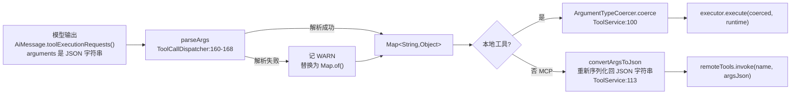
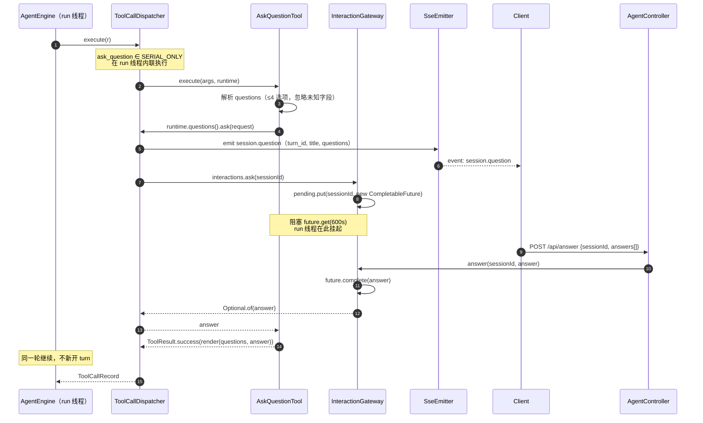

# 04 · 工具调用

> 工具子系统覆盖「定义 → 注册 → 暴露 Schema → 解析参数 → 权限门禁 → 派发执行 → 结果处理」全链路，本地工具与 MCP 远程工具走同一个注册表但对模型呈现为同质的工具列表。

## 关键类

| 类 | 路径 | 职责 |
|---|---|---|
| `ToolExecutor` | `tool/ToolExecutor.java` | 工具真实逻辑的 SPI（`@FunctionalInterface`） |
| `ToolDescriptor` | `tool/ToolDescriptor.java` | name + description + permission + specification + executor |
| `ToolService` | `tool/ToolService.java` | 本地/MCP 统一注册表与执行路由 |
| `ToolCallDispatcher` | `engine/exec/ToolCallDispatcher.java` | 派发：串行/并行混合、保序、异常隔离 |
| `ToolRuntime` | `tool/ToolRuntime.java` | 一次调用的会话上下文投影（record） |
| `ToolResult` / `ToolResultView` / `ToolCallRecord` | `tool/`、`tool/model/` | 结果三形态 |
| `ArgumentTypeCoercer` | `tool/ArgumentTypeCoercer.java` | 按 Schema 声明类型纠偏模型给的参数 |
| `PathResolver` | `tool/PathResolver.java` | 路径沙箱 |
| `ToolPermission` | `tool/ToolPermission.java` | READONLY / RESTRICTED_WRITE / DESTRUCTIVE |
| `RemoteToolInvoker` / `McpServerClient` | `tool/`、`tool/mcp/` | MCP 端口与 Streamable HTTP 适配器 |
| `QuestionChannel` / `InteractionGateway` | `tool/`、`runtime/` | 人机交互阻塞-唤醒 |

---

## 1. 两段式工具 SPI

一个内置工具由**两个互不相干的部分**组成，这是本项目最不直观的设计，先讲清楚。

### 真实逻辑：`ToolExecutor`

`tool/ToolExecutor.java:8-22`：

```java
@FunctionalInterface
public interface ToolExecutor {
    ToolResult execute(Map<String, Object> arguments, ToolRuntime runtime);
    default void close() {}   // 应用关闭时由 ToolService.closeAll() 统一调用
}
```

参数是**已经解析好的 `Map<String,Object>`**，工具自己按 key 取值（`arguments.get("questions")`）。

### Schema 生成：一个永不被调用的 `@Tool` 哑方法

每个工具类里另有一个带 LangChain4j `@Tool` / `@P` 注解的方法，**方法体直接 `return null`**。`tool/builtin/AskQuestionTool.java:76-88`：

```java
/** 仅用于生成 ToolSpecification，LangChain4j 不会调用它。 */
@Tool(name = "ask_question", value = { ...4 行描述... })
public String askQuestion(
        @P(name = "questions", description = "...") List<QuestionInput> questions,
        @P(name = "title", description = "...") String title
) { return null; }
```

它唯一的作用是给 `ToolSpecifications.toolSpecificationsFrom(executor)` 提供元数据，从注解与方法签名反推出 JSON Schema（`tool/ToolDescriptor.java:50`）。

**没有注解驱动的发现机制，也没有对工具的 Spring 组件扫描**——哑方法只是 schema 的"声明文件"。

### `ToolDescriptor.fromAnnotated`（`:49-57`）

```java
List<ToolSpecification> specs = ToolSpecifications.toolSpecificationsFrom(executor);
if (specs.isEmpty()) throw new IllegalArgumentException("未在 " + executor.getClass().getName() + " 上找到 @Tool 注解方法");
ToolSpecification spec = specs.get(0);          // ← 只取第一个
return new ToolDescriptor(spec.name(), spec.description(), permission, spec, executor);
```

两个隐含约束：

- 一个工具类里写多个 `@Tool` 方法，**只有第一个生效**，其余静默忽略。
- descriptor 上**没有 streaming 标志**。工具参数的流式增量（`engine.tool_delta`）是 LLM 层的统一行为，对所有工具一视同仁，不需要工具声明。

---

## 2. 九个内置工具

装配顺序硬编码在 `config/AgentBeans.java:49-83`，`ToolService` 用 `LinkedHashMap` 存储（`tool/ToolService.java:16`）所以顺序被保留，最终也决定了 `getSpecifications()` 里工具的出现顺序。

| 工具名 | 类 | 权限 | 内部限制 / 关键行为 |
|---|---|---|---|
| `read_file` | `ReadFileTool` | READONLY | 默认分页 2000 行（`:25`）；支持 `artifact://` 前缀读取落盘内容（`:27`）；返回 `successFile` / `successArtifact` 视图 |
| `write` | `WriteFileTool` | RESTRICTED_WRITE | 创建或**覆盖**文件（`:64-67` 描述明示） |
| `list_dir` | `ListDirTool` | READONLY | 返回 `dir_list` 视图（`DirEntry{name,type,size}`） |
| `download_file` | `DownloadFileTool` | RESTRICTED_WRITE | 超时 60s（`:30`）；大小上限 `eon.tools.download.max_file_size_mb`×1024×1024（`AgentBeans.java:52-54`）；流式直写磁盘，**不经对话上下文** |
| `todo_write` | `TodoWriteTool` | RESTRICTED_WRITE | 单焦点校验（≤1 个 IN_PROGRESS）；**串行豁免**；成功后触发 `session.todo` 事件与快照钩子 |
| `update_memory` | `UpdateMemoryTool` | **READONLY** | 注意：它写磁盘（`{base_dir}/memories/`）却声明为 READONLY（`:41`） |
| `web_search` | `WebSearchTool` | READONLY | 超时 30s（`:31`）；**仅当 `QIANFAN_API_KEY` 非空才注册**（`AgentBeans.java:58-70`），否则记 WARN 跳过 |
| `web_fetch` | `WebFetchTool` | READONLY | 超时 30s（`:34`）；内容截断 `max_content_length`=50000 字符；LRU 缓存（TTL 15min / 64 条）；摘要缺失时从正文截 200 字符（`:37`）；返回 `web_page` 视图 |
| `ask_question` | `AskQuestionTool` | READONLY | 选项上限 4，超出截断（`:32`）；**串行豁免**；阻塞等用户回答 |

`update_memory` 的权限声明值得留意：按 `ToolPermission` 的语义分级（`tool/ToolPermission.java:4`「READONLY → RESTRICTED_WRITE → DESTRUCTIVE」）它应该是写操作，但被标为 READONLY。因为 GateHook 只拦 DESTRUCTIVE，这个差异目前没有实际后果。

---

## 3. 注册、白名单与上线格式

### `ToolService` 不是 Spring 组件

它由 `@Bean(destroyMethod = "closeAll")` 在 `config/AgentBeans.java:43-89` 手工装配，构造函数接收白名单与 `ObjectMapper`（`tool/ToolService.java:24-28`）。`closeAll()`（`:157-161` 起）在容器关闭时逐个调用 `executor.close()`。

### 白名单只作用于本地工具

```java
// tool/ToolService.java:31-38
public void register(ToolDescriptor descriptor) {
    if (!whitelist.isEmpty() && !whitelist.contains(descriptor.getName())) {
        log.warn("工具 {} 不在白名单中，跳过注册", descriptor.getName());
        return;
    }
    tools.put(descriptor.getName(), descriptor);
}
```

`eon.tools.whitelist` 列了 9 项，与 `AgentBeans` 里注册的 9 个工具一致（`web_search` 可能因缺 key 而不注册，此时白名单里留着它也无害）。

**MCP 工具显式绕过白名单**——`registerMcpTools` 的 javadoc（`:40-41`）写明「不受本地白名单限制」，它写的是 `mcpToolSpecs` / `mcpToolSources` 两个独立 map（`:21-22`），不经过 `register()`。

### 暴露给模型的 Schema

```java
// tool/ToolService.java:85-92
public List<ToolSpecification> getSpecifications() {
    List<ToolSpecification> all = new ArrayList<>();
    for (ToolDescriptor desc : tools.values()) all.add(desc.getSpecification());
    all.addAll(mcpToolSpecs.values());      // 本地在前，MCP 在后
    return all;
}
```

`AgentEngine` 每次模型调用都传这个列表（`engine/AgentEngine.java:131`、`:136`），`LlmClient` 挂到 LangChain4j 请求上，最终由 `OpenAiChatModel` 序列化为 OpenAI 的 `tools: [{type:"function", function:{name, description, parameters:<JSON Schema>}}]`。

上下文侧对这个列表做**平坦 token 估算：工具数 × 220**（`engine/AgentEngine.java:50`、`:289-291`），计入水位分子。所以每多注册一个 MCP 工具，水位就涨约 220 token——工具很多时这会实质压缩历史消息的可用空间。

---

## 4. 参数处理链



### `parseArgs` 的降级策略（`engine/exec/ToolCallDispatcher.java:160-168`）

```java
private Map<String, Object> parseArgs(String json) {
    if (json == null || json.isBlank()) return Map.of();
    try {
        return objectMapper.readValue(json, new TypeReference<>() {});
    } catch (Exception e) {
        log.warn("[ToolExecution] 参数解析失败: {}", json, e);
        return Map.of();       // ← 不抛异常，降级为空 map
    }
}
```

**这是有意设计**：畸形 JSON 降级为空 map 后，工具会用自己的校验报出「缺少 'xxx' 参数」这类**语义化**错误，模型据此能自我纠正；如果直接把 JSON 语法错误抛回去，模型往往只会重复同样的错误。

### `ArgumentTypeCoercer`（`tool/ArgumentTypeCoercer.java`）

`coerce(spec, args)`（`:26-49`）遍历 `spec.parameters().properties()`，按 Schema 声明的类型对每个属性做纠偏，产出**新的 `LinkedHashMap`**（不改原 map）。前置短路：args 为空、spec 为 null、properties 为空时原样返回。

| Schema 类型 | 转换规则 | 行号 |
|---|---|---|
| `JsonArraySchema` | 已是 `List` 直接过；String 若能 `readValue` 出 `List` 则替换。**不会把单个标量包成单元素数组** | `:70-80` |
| `JsonBooleanSchema` | String `"true"`/`"false"`（trim + 忽略大小写）→ Boolean | `:83-91` |
| `JsonIntegerSchema` | 任意 `Number` → `intValue()`；数字 String → `Integer.parseInt` | `:94-104` |
| `JsonNumberSchema` | 任意 `Number` → `doubleValue()`；数字 String → `Double.parseDouble` | `:107-117` |
| String / Object / 其他 | **不转换** | `:65-66` |

所有转换失败都是**静默的**（catch 后 `ignored`，保留原值）。纠偏不了的值会原样交给工具，由工具自己的校验报错。

**MCP 工具不经过纠偏**——`ToolService.execute` 的 MCP 分支（`:110-121`）直接把 map 重新序列化成 JSON 字符串传给 `RemoteToolInvoker.invoke`，跳过了 `coercer`。

### 校验失败的三条路径

| 情况 | 处理者 | 结果 |
|---|---|---|
| 工具名不存在 | `ToolValidationHook`（PostModel, order=10） | nudge + `skip()`，**整批丢弃**，不产生 tool_result |
| 输出被截断（`finishReason=length`） | `TruncationHook`（PostModel, order=5） | nudge + `skip()` |
| 工具自身参数不合法 | 各工具的 `execute` | `ToolResult.failure("缺少 'xxx' 参数")`，正常写回账本 |

前两条走钩子（模型下一轮看到 nudge），第三条走正常工具结果（模型当轮就看到失败原因）。详见 [03-hooks.md](03-hooks.md)。

---

## 5. 权限模型与路径沙箱

### `ToolPermission`（`tool/ToolPermission.java:6-10`）

三级递进：`READONLY` → `RESTRICTED_WRITE` → `DESTRUCTIVE`。

### `GateHook` 只校验 DESTRUCTIVE

`engine/hook/pretool/GateHook.java:47-58`：

```java
for (ToolExecutionRequest req : requests) {
    if (!toolService.isDestructive(req.name())) continue;
    if (autoApproveDestructive) {
        log.warn("[Gate] 破坏性工具 '{}' 已自动批准 | 参数: {} | turn: {}", ...);
    } else {
        return HookResult.stop(StopCategory.GATE_REJECTED, StopCategory.GATE_REJECTED.format(req.name()));
    }
}
```

`RESTRICTED_WRITE` 这一级**目前没有任何代码消费它**——它只是被记录在注册日志里（`tool/ToolService.java:37`）。整个权限体系实际只有「DESTRUCTIVE 会被 GateHook 看到」和「其他都不会」两种状态。

`autoApproveDestructive` 在 GateHook **构造函数**里读一次存为 final（`:26`、`:30`），改配置需重启。默认 `true`，且该键在 `application.yml` 中缺失。

**拒绝面向用户而非模型**：走 `stop` → `forceTerminate` → `session.error`(type=`GATE_REJECTED`) + `session.status: terminated`，任务结束。模型看不到 tool_result；`TurnMessageWriter` 也不会写入 `tool_calls`（`engine/exec/TurnMessageWriter.java:27-30`），账本不留悬空调用。

结合「无内置工具声明 DESTRUCTIVE」+「MCP 工具权限硬编码 READONLY」+「默认自动批准」，**这条门禁路径当前完全休眠**。见 [08-design-gaps.md](08-design-gaps.md) 第 2、3 条。

### 路径沙箱（`tool/PathResolver.java`）

会话级对象，构造时接收 `workDir`（= `download` 目录）、`sessionDir`、`sandboxEnabled`（`:14-18`）。

`resolve(rawPath)`（`:34-55`）：

1. 空路径 → `IllegalArgumentException("路径为空")`
2. **绝对路径**直接用（`toAbsolutePath().normalize()`）；**相对路径**基于 `workDir` 解析
3. 沙箱开启时，归一化结果必须 `startsWith(workspace)`，否则抛 `"路径 'xxx' 超出工作区边界 (解析后: yyy)"`

因为先 `normalize()` 再比较前缀，`..` 穿越会被第 3 步捕获。工具把这个异常转成 `ToolResult.failure("路径解析失败: ...")`。

`relativize(absolute)`（`:62-70`）把绝对路径还原为**正斜杠的、相对工作目录**的形式；不在工作目录内（沙箱关闭时）则退化为纯文件名。`:58-60` 的注释点明意图：工具回传路径与 HTTP 文件接口都走这里，**保证两侧对「相对路径」的定义一致**——`FileService.locate` 用的是同一个 resolver。

---

## 6. 派发执行

### 串行 / 并行混合，结果保序

`engine/exec/ToolCallDispatcher.java:60-108`。核心是 `SERIAL_ONLY = Set.of("todo_write", "ask_question")`（`:37`）：

```java
ToolCallRecord[] results = new ToolCallRecord[requests.size()];   // 预分配，按下标写回
for (int i = 0; i < requests.size(); i++) {
    ToolExecutionRequest req = requests.get(i);
    if (SERIAL_ONLY.contains(req.name())) {
        results[i] = runSerial(r, runtime, req);                  // 在 run 线程内联执行
    } else {
        futures.add(parallelExecutor.submit(() -> executeSingle(r, runtime, call)));
        pendingIndices.add(i);
    }
}
for (int j = 0; j < pendingIndices.size(); j++) {
    results[pendingIndices.get(j)] = futures.get(j).get();        // 无超时
}
```

- **串行豁免**的两个工具在 run 线程上直接跑。`todo_write` 是顺序敏感（并发改 TodoStore 会丢更新），`ask_question` 是交互互斥（一个会话同时只能有一个待答问题）。
- 其余提交到 `tool-exec` 固定池（`Executors.newFixedThreadPool(eon.tools.parallelism)`，daemon 线程，`:49-55`，默认 4）。
- **保序**靠预分配数组 + 下标写回，与 future 完成顺序无关。
- `@PreDestroy shutdown()`（`:170-181`）：优雅关闭，5s 后 `shutdownNow()`。

### `executeSingle` 的五步（`:123-145`）

1. `emit(AgentToolUse)` — 携带**原始 JSON 参数字符串**（不是解析后的 map）
2. **熔断拦截** — `if (circuitBreaker().isTripped(name)) return syntheticError(...)`，工具根本不执行（`:130-134`）
3. `parseArgs` → `toolService.execute(name, args, runtime)`
4. `emit(AgentToolResult)` — 携带 content、view、success
5. 返回 `ToolCallRecord(req.id(), req.name(), success, content, view)`

### `ToolRuntime`：RunContext 的投影

工具**拿不到 `RunContext`**。派发器每次把会话状态投影成一个 record（`:62-73`）：

```java
ToolRuntime runtime = new ToolRuntime(
        r.session().todoStore(), r.session().artifactStore(), r.session().memoryStore(),
        r.session().pathResolver(), r.task().turnCount(), r.session().sessionId(),
        request -> { r.emit(AgentQuestion.now(...)); return interactions.ask(r.session().sessionId()); },
        () -> r.emit(AgentTodo.now(r.task().turnId(), r.session().todoStore().getAll())));
```

`tool/ToolRuntime.java:8-11` 的 javadoc 是硬性约束：

> 工具实例是应用级单例，本 record 中的 store/pathResolver 是会话级对象，**严禁把它们存进工具的字段**——execute() 只能在方法内使用。

后两个参数是回调而非数据：`questions`（提问通道，仅 `ask_question` 用）与 `todoChanged`（待办变更出口，仅 `todo_write` 用）。`tool/QuestionChannel.java:5-8` 的注释解释了为什么"发事件"和"等答案"被合并成一次调用：

> 「发事件」与「等答案」由调度器一并装配，工具只看到这一次调用——它拿不到 RunContext，不该自己 emit。

### 超时、取消与中断

| 项 | 现状 |
|---|---|
| 派发层超时 | **无**。`futures.get(j).get()` 没有 deadline（`:94`） |
| 工具内部超时 | download 60s / web_fetch 30s / web_search 30s / ask_question 由网关 600s 兜底 |
| 取消 | 协作式。运行中的 future **从不 `cancel(true)`** |
| 中断响应 | 引擎在派发返回后、以及每个 PostTool 之前查 `isInterrupted()` |
| `InterruptedException` | 重新置中断位 + 合成 `"并行执行被中断: ..."`（`:95-97`） |
| `ExecutionException` | 拆 cause + 合成 `"工具执行异常: ..."`（`:98-102`） |

一个卡死的工具会无限期占住一个 `tool-exec` 线程；池只有 4 个线程，四次即耗尽。见 [08-design-gaps.md](08-design-gaps.md) 第 5 条。

### 三层异常收敛

工具异常**从不冒泡到循环**，三层各自兜住并转成失败结果：

| 层 | 位置 | 产出 |
|---|---|---|
| executor 抛异常 | `tool/ToolService.java:104-107` | `ToolResult.failure("工具执行失败: " + msg)` |
| MCP invoke 抛异常 | `tool/ToolService.java:117-120` | `failure("远程工具执行失败: " + msg)` |
| 工具名不存在 | `tool/ToolService.java:123` | `failure("工具不存在: " + name)` |
| dispatcher 层抛异常 | `engine/exec/ToolCallDispatcher.java:148-156` | `syntheticError`，**仍发 `tool_result` 事件**保证前端 UI 一致 |

失败结果随后喂给 `ToolFailureHook` → 熔断器（连续 3 次告警、5 次熔断，见 [03-hooks.md](03-hooks.md)）。

---

## 7. 结果的三种形态

| 类型 | 定义 | 生命周期 |
|---|---|---|
| `ToolResult` | `record(boolean success, String content /*给模型*/, ToolResultView toolResultView /*给前端*/)`（`tool/ToolResult.java:8-12`） | 工具 → dispatcher，瞬时 |
| `ToolCallRecord` | `record(toolCallId, toolName, success, content, toolResultView)`（`tool/model/ToolCallRecord.java:6-7`） | **轮内瞬态**，存在 `TurnScope.toolResults`，`flush` 后清空 |
| `ledger.jsonl` 的 tool 行 | `SerializedMessage` 带 `toolCallId`/`toolName`/`content`/`success`/`toolResultView`（`store/ledger/LedgerStore.java:74-87`、`:127-139`） | 永久 |

`ToolResult` 的五个工厂：`success(text)`（自动包 text 视图）、`successFile(modelContent, filePath, fileSize, sizeBytes)`、`successArtifact(modelContent, artifactId)`、`success(content, customView)`、`failure(content)`。

**给模型的内容与给前端的内容是分离的**：`content` 是纯文本（会被入站管线套壳、可能被压缩），`toolResultView` 是结构化数据（原样存账本，回放时原样发给前端）。

### `ToolResultView`（`tool/model/ToolResultView.java`）

五种 `type`，字段按类型取用，未涉及字段恒为 null：

| type | 使用字段 | 工厂 |
|---|---|---|
| `text` | `text` | `ToolResultView.text(t)` |
| `file` | `filePath`（相对会话工作目录）、`fileSize`（人类可读如「12 行, 345 字符」）、`sizeBytes`（真实字节数，前端据此决定是否截断预览） | `.file(path, size, bytes)` |
| `artifact` | `artifactId` | `.artifact(id)` |
| `dir_list` | `text`（路径）、`entries: List<DirEntry{name,type,size}>` | `.dirList(path, entries)` |
| `web_page` | `pages: List<WebPage{url,title,description,favicon,siteName,contentLength,success}>` | `.webPages(pages)` |

`:8-11` 的 javadoc 是一条前端契约：**历史账本反序列化时缺失字段同为 null，前端不得假定非空**。回放路径上，view 缺失时退化为 `ToolResultView.text(content)`（`store/ledger/LedgerReplayer.java`）。

`WebPage.failed(url, reason)` 把错误原因塞进 `description` 字段并置 `success=false`（`:92-94`）——部分成功部分失败的批量抓取靠这个区分。

### 大结果的两道截断

| 机制 | 位置 | 行为 |
|---|---|---|
| 工具内截断 | `web_fetch`（`tool/builtin/WebFetchTool.java:168-170`）：超过 `max_content_length`=50000 字符时截断并追加 `\n... [内容已截断，截断于 N 字符]`<br/>`read_file`（`tool/builtin/ReadFileTool.java:25`、`:115-118`）：默认 2000 行分页，未读完时追加 `(共 N 行，已显示第 a-b 行，可调整 offset/limit 继续读取)` | 源头限流 |
| 入站落盘 | `IngestPipeline`：>12000 字符 → `ArtifactStore` + 头尾 8000 摘要 + `artifact://` 指针 | 上下文限流 |

两者互补，`read_file` 支持 `artifact://` 前缀（`tool/builtin/ReadFileTool.java:27`）构成落盘内容的取回闭环。详见 [02-context.md](02-context.md) 第 5、6 节。

---

## 8. MCP 集成

### 传输：Streamable HTTP

`tool/mcp/McpServerClient.java:37-45`：

```java
McpTransport transport = StreamableHttpMcpTransport.builder()
        .url(serverUrl).logRequests(false).logResponses(false).build();
mcpClient = DefaultMcpClient.builder().key(serverKey).transport(transport).build();
```

**不是 stdio，也不是旧版 SSE transport。** 配置里只有一个 `url`（`application.yml:113-119`）。

### 生命周期

| 阶段 | 行为 | 位置 |
|---|---|---|
| 启动 | 遍历 `mcpConfig.getEnabledServers()`，逐个 `connect()` + `registerMcpTools()` | `config/AgentBeans.java:165-190` |
| 连接失败 | `connect()` 抛 `RuntimeException`（`McpServerClient.java:49`），被 `AgentBeans:186-188` catch → 记 ERROR 并**跳过该服务，不阻断启动** | |
| URL 缺失 | 记 WARN 跳过（`AgentBeans.java:174-177`） | |
| 关闭 | `@PreDestroy shutdown()` 逐个 `close()`（`AgentBeans.java:152-162`） | |
| **运行期断连** | **无重连、无健康检查**。`listTools()` 记 ERROR 返回空列表（`McpServerClient.java:60-65`）；`invoke()` 在 client 为 null 时返回 `failure("MCP 客户端未连接")`（`:71-73`），异常时返回 `failure("MCP 工具执行失败: ...")`（`:83-86`） | |

### 合并语义

`registerMcpTools(invoker, permission)`（`tool/ToolService.java:44-61`）把每个远程 spec 按**裸工具名**存进 `mcpToolSpecs` + `mcpToolSources`。路由时**本地优先**：`execute` 先查 `tools.get(name)`（`:96`），查不到才走 MCP 分支（`:110`）。所以与内置工具同名的 MCP 工具会被本地工具遮蔽，且不会有任何警告。

`invoke()` 把结果统一包成 `ToolResult.success(resultText)`（`McpServerClient.java:82`）——**MCP 结果一律是纯文本视图，没有 `ToolResultView` 富化**，前端只能用 text 渲染器。

### 权限配置是装饰性的

`registerMcpTools` 解析了 `permission` 参数（`:45`），但解析结果 `perm` **只出现在 `:56-57` 的日志行里，从未存储**；`getPermission()` 对任何 MCP 工具硬编码返回 `READONLY`（`:132-134`）。把 `application.yml:119` 改成 `DESTRUCTIVE` 不会让 GateHook 拦截它。见 [08-design-gaps.md](08-design-gaps.md) 第 2 条。

---

## 9. 人机交互闭环（`ask_question`）



### 关键实现点

**网关**（`runtime/InteractionGateway.java`）：`ConcurrentHashMap<String, CompletableFuture<InteractionAnswer>>`，**每会话最多一个待答问题**（`:18` 类注释）。

- `ask(sessionId)`（`:34-50`）：建 future → put → `future.get(timeoutSeconds)`（`eon.interaction.timeout_seconds`，默认 600s）→ `finally` 里 `pending.remove(sessionId, future)`。`TimeoutException` / `InterruptedException` / `ExecutionException` **一律返回 `Optional.empty()`**，不抛异常。
- `answer(sessionId, answer)`（`:53-60`）：没有 pending 时返回 `false`——用户重复提交或答案来晚了。
- `cancel(sessionId)`（`:63-68`）：`completeExceptionally(new CancellationException("run interrupted"))`，用于中断或会话释放时唤醒阻塞线程。

**工具侧**（`tool/builtin/AskQuestionTool.java:112-117`）：

```java
InteractionAnswer answer = runtime.questions()
        .ask(new InteractionRequest(title, toViews(questions)))
        .orElse(null);

// 超时/中断不算工具失败：判失败会触发熔断，而这里只是没人回答
return answer == null ? ToolResult.success(NO_ANSWER) : ToolResult.success(render(questions, answer));
```

`:116` 的注释是个重要设计决策：**没人回答不是工具的错**，判失败会误触熔断计数。`NO_ANSWER` 文案（`:35-36`）明确要求模型「基于已有信息自行决策并继续推进；若确实缺少必要前提，用文字直接向用户说明，**不要再调用本工具追问**」——防止模型陷入反复提问的死循环。

`render()`（`:179-209`）产出 `用户已回答：\n1. <prompt>\n   <labels、other 或「（未选择）」>`。`:178` 的注释说明未回答的题目要**显式标注**，「避免模型误以为用户默许」。

**中断联动**：`ask_question` 阻塞在 `future.get()` 上，**不会轮询 `interrupted` 标志**。所以 `POST /api/interrupt` 必须同时调 `interactions.cancel(sessionId)`（`api/service/ChatServiceImpl.java:169-170`，注释：「阻塞在提问里的工具线程不会轮询中断标志，必须显式唤醒」）。`ChatServiceImpl.execute` 的 finally 块也无条件调一次 `cancel`（`:132`），保证 run 结束后不留悬挂问题。

**SSE 超时的由来**：emitter 超时设为 `eon.interaction.sse_timeout_seconds`（默认 1800s），`api/service/ChatServiceImpl.java:88` 的注释：「一次 run 里可能多次阻塞等用户回答，超时必须覆盖『执行 + 等待』，不能沿用默认的 5 分钟」。

---

## 相关篇章

- [01-engine.md](01-engine.md) — Extension Loop 里派发的调用时机与中断检查点
- [02-context.md](02-context.md) — 工具结果的入站格式化、落盘与压缩
- [03-hooks.md](03-hooks.md) — `GateHook` / `ToolValidationHook` / `ToolFailureHook` 与熔断器
- [05-events-api.md](05-events-api.md) — `engine.tool_use` / `engine.tool_result` / `session.question` / `session.todo` 的载荷定义，`POST /api/answer` 的请求体
- [06-persistence.md](06-persistence.md) — `ArtifactStore` 的命名规则与 `read_file` 取回路径、`TodoStore` 的持久化
- [07-configuration.md](07-configuration.md) — `eon.tools.*` / `eon.mcp.*` / `eon.interaction.*` / `eon.web_search.*`
- [08-design-gaps.md](08-design-gaps.md) — MCP 权限装饰性、GateHook 休眠、派发层无超时
