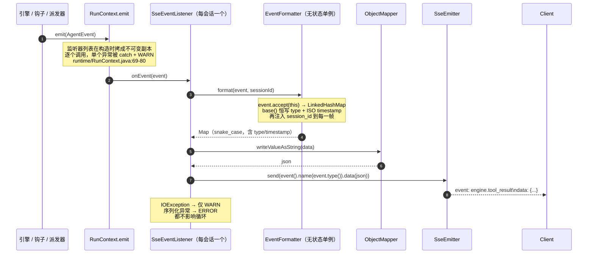

# 05 · 事件模型与 HTTP/SSE 接口

> 事件模型是引擎与前端的唯一契约：**实时推送**与**历史回放**两条链路产出形状完全一致的事件，靠同一个 `EventFormatter` 序列化。前端只需实现一套渲染逻辑。

## 关键类

| 类 | 路径 | 职责 |
|---|---|---|
| `AgentEvent` | `event/AgentEvent.java` | 事件基接口：`type()` / `timestamp()` / `accept(visitor)` |
| `AgentEventVisitor<T>` | `event/AgentEventVisitor.java` | 14 个 `visit*` + `visitUnknown` 兜底 |
| `AgentEventListener` | `event/AgentEventListener.java` | 消费端接口，`onEvent(AgentEvent)` |
| `EventFormatter` | `api/sse/EventFormatter.java` | 访问者实现，事件 → snake_case Map，**实时与回放共用** |
| `SseEventListener` | `api/sse/SseEventListener.java` | 每会话一个实例，Map → JSON → SSE 帧 |
| `AgentController` | `api/AgentController.java` | 对话/中断/回答/会话管理端点 |
| `FileController` | `api/FileController.java` | 会话工作区文件端点 |
| `LlmService` / `LlmClient` | `llm/` | LLM 抽象与实现（同步 + 流式 + 重试） |

---

## 1. 事件层次

`event/AgentEvent.java:9-19`：

```java
public interface AgentEvent {
    String type();                            // SSE 事件名，用作 event: xxx 行
    Instant timestamp();
    <T> T accept(AgentEventVisitor<T> visitor);
}
```

`event/AgentEvent.java:6-7` 的类注释点明了双重身份：「每个事件对应前端一个渲染单元，也是 SSE 推送的一个数据帧」。

新增事件类型需要同时改三处：定义 record、在 `AgentEventVisitor` 加 `visit*` 方法、在 record 里实现 `accept`（`event/AgentEventVisitor.java:4` 注释即此意）。`visitUnknown`（`:37`）是兜底，但访问者模式下漏实现会**编译失败**，所以兜底实际不会被走到。

---

## 2. 十四个事件全表

`type()` 返回的字符串就是 SSE 的 `event:` 名。「回放」列表示 `GET /api/sessions/{id}` 是否会重现该事件。

| record | `type()` | 载荷字段 | 回放 | 说明 |
|---|---|---|---|---|
| `SessionStart` | `session.start` | `sessionId`, `title` | ✅ 合成 | `title` 回放时为 null（`SessionStart.java:10`）；实时路径由 `ChatServiceImpl:120` 发首帧交付会话身份 |
| `UserMessage` | `user.message` | `content` | ✅ | **只在回放时产出**（`UserMessage.java:6-9`）；实时路径下客户端自己就有这条消息 |
| `AgentDelta` | `engine.delta` | `turnId`, `kind`("text"\|"thinking"), `delta` | ❌ | 仅流式模式出现，历史不保留（`AgentDelta.java:6-7`） |
| `AgentToolDelta` | `engine.tool_delta` | `turnId`, `index`, `toolUseId`, `name`, `delta`(部分 JSON 参数) | ❌ | 进度展示用（`AgentToolDelta.java:6-8`） |
| `AgentThinking` | `engine.thinking` | `turnId`, `content`（完整推理链） | ✅ | 从账本 ai 行的 `thinking` 还原 |
| `AgentMessage` | `engine.message` | `turnId`, `messageId`, `content: List<ContentPart{type,text}>` | ✅ | 回放时 `messageId` 为 `"msg_replay_" + seq` |
| `AgentToolUse` | `engine.tool_use` | `turnId`, `toolUseId`, `name`, `input`（**原始 JSON 字符串**） | ✅ | 从 ai 行的 `toolCalls` 还原，一条 ai 行可产多个 |
| `AgentToolResult` | `engine.tool_result` | `turnId`, `toolUseId`, `name`, `content`, `toolResultView`, `success` | ✅ | 从 tool 行还原；view 缺失时退化为 `ToolResultView.text(content)` |
| `AgentHook` | `engine.hook` | `turnId`, `hook`（钩子名） | ❌ | 仅 `ContextCompressionHook` 在调摘要 LLM 前发出 |
| `AgentQuestion` | `session.question` | `turnId`, `title`, `questions: List<Map>` | ❌ | `ask_question` 阻塞前发出 |
| `AgentTodo` | `session.todo` | `turnId`, `todos: List<TodoItem>` | ✅ 末尾补发 | 总是**全量**状态；空数组意味着「移除卡片」（`AgentTodo.java:8-11`） |
| `SessionStatus` | `session.status` | `status`("running"\|"idle"\|"terminated"), `stopReason` | ✅ 末尾补发 | 回放结尾固定补 `idle("replay_completed")` |
| `SessionUsage` | `session.usage` | `turnId`, `messageId`, `promptTokens`, `completionTokens`, `totalTokens` | ❌ | 任务退出时发一次，报的是**会话累计**而非单轮 |
| `SessionError` | `session.error` | `message`, `type`（= `StopCategory` 名或异常类型） | ❌ | 强制终止时先发它再发 `terminated` |

`ContentPart`（`event/ContentPart.java:6-12`）不是事件，是 `AgentMessage.content` 的元素类型，目前只有 `text` 一种。

### 事件命名的一个坑

`EventFormatter.visitError`（`api/sse/EventFormatter.java:137-142`）把 `SessionError.type()` 序列化为 **`error_type`** 而不是 `type`——因为 `type` 字段已经被 `base()` 用来放事件名（`session.error`）了。前端读错误分类时要取 `error_type`。

同理，`visitStatus` 里 `SessionStatus.status()` 序列化为 `status`（`:131`），与 `base()` 的 `type`（值为 `session.status`）并存。

---

## 3. 发射与编码链



### `EventFormatter` 的无状态设计

`api/sse/EventFormatter.java:17` 的注释：「sessionId 走参数而非成员字段，使本类无状态、可被多个会话共享」。它是 `@Component` 单例，`format(event, sessionId)`（`:18-22`）先 `event.accept(this)` 得到 Map，再 `data.put(SESSION_ID_FIELD, sessionId)`——**每一帧都带 `session_id`**。

`base(e)`（`:156-161`）用 `LinkedHashMap` 保证字段顺序，恒写两项：

```java
data.put("type", e.type());
data.put("timestamp", e.timestamp().toString());   // ISO-8601
```

`visitToolResult`（`:106-115`）把 `toolResultView` 序列化为 **`structured_content`**（不是 `tool_result_view`），这是前端拿结构化渲染数据的字段。

各 `visit*` 对可空字段的处理不统一：`visitDelta` / `visitToolDelta` / `visitQuestion` / `visitSessionStart` / `visitStatus` 做了 null 判断后**省略字段**；`visitThinking` / `visitMessage` / `visitToolUse` / `visitToolResult` / `visitError` **直接 put**（可能写入 null 值）。`visitTodo` 把 null 转为 `List.of()`（`:101`）。

### `SseEventListener`

`api/sse/SseEventListener.java`。**每会话一个实例**（在 `ChatServiceImpl:117` 构造），所以 `sessionId` 可以是 final 字段。类注释（`:13`）：「实例绑定单个会话，故每帧都能携带 session_id」。

`onEvent`（`:31-43`）的异常处理分两级：`IOException`（客户端断开）只记 WARN；其他异常（序列化失败）记 ERROR。**两者都不抛出**——配合 `RunContext` 的逐监听器 try/catch，形成双重保护：一个坏客户端不可能杀死 Agent 循环。

### 回放链路的形状一致性

`api/service/SessionServiceImpl.getSessionEvents`（`:81-97`）：

```java
List<AgentEvent> events = new ArrayList<>();
// session.start 不落盘，回放时补发首帧，使两条链路的事件形状一致
events.add(SessionStart.now(sessionId, null));
events.addAll(replayer.replay(ledgerPath(sessionId)));
// 待办是会话级状态、不在账本里，回放末尾补发一次，让遗留的未完成项也能呈现
List<TodoItem> todos = loadTodos(sessionId);
if (!todos.isEmpty()) events.add(AgentTodo.now(null, todos));
for (AgentEvent event : events) rendered.add(formatter.format(event, sessionId));
```

三处"补齐"：开头的 `session.start`、结尾的 `session.todo`（有则发）、以及 `LedgerReplayer` 自己补的结尾 `session.status: idle("replay_completed")`（`store/ledger/LedgerReplayer.java:63`）。

`loadTodos`（`:103-110`）优先读缓存里的活 `TodoStore`，缓存未命中（服务重启后打开旧会话）时回退读 `state.json` 快照——**不需要为了看历史而装配整个会话**。

### `LedgerReplayer` 的映射规则

`store/ledger/LedgerReplayer.java:18-22` 类注释即规则表。实现细节：

- 整次回放共用一个 `turnId = "replay_" + 8位hex`（`:46`），所以回放事件里的 `turn_id` **不区分轮次**；前端靠 `user.message` 事件切分回复轮次（`:103` 注释）
- ai 行 → `AgentThinking`（thinking 非空）+ `AgentMessage`（content 非空）+ N × `AgentToolUse`，三者独立还原，「文本不因伴随工具调用而丢弃」（`:83-101`）
- tool 行 → `AgentToolResult`，`success` 用 `Boolean.TRUE.equals(sm.success)` 做 null 安全判断（`:119`）
- system 行与未知类型 → 不产生事件（`:79`）
- 反序列化失败的行记 WARN 后跳过，不中断整体回放（`:55-58`）
- **始终从第 0 行读，无视压缩水位线**——所以前端看到完整未压缩历史，而 LLM 窗口可能已被压缩（详见 [06-persistence.md](06-persistence.md)）

---

## 4. HTTP API

### `AgentController`（`api/AgentController.java`，base `/api`）

用户身份走请求头 `X-User-Id`，缺省 `"default"`（`:22-23`）。

| 方法 | 路径 | 请求 | 响应 |
|---|---|---|---|
| POST | `/api/chat` | body `ChatRequest`，header `X-User-Id` | `SseEmitter`，`produces=text/event-stream`（`:36-44`） |
| POST | `/api/interrupt` | `InterruptRequest{sessionId}` | `{"status": "interrupted" \| "no_session"}`（`:46-50`） |
| POST | `/api/answer` | `AnswerRequest{sessionId, answers[]}` | `{"status": "answered" \| "no_pending"}`（`:53-57`） |
| GET | `/api/sessions` | header `X-User-Id` | `List<SessionListItem>`（`:59-63`） |
| GET | `/api/sessions/{sessionId}` | path var | `List<Map<String,Object>>` — 回放事件（`:73-76`） |
| DELETE | `/api/sessions/{sessionId}` | path var + header | `{"status": "deleted" \| "not_found", "session_id": ...}`（`:65-70`） |

**DTO 定义**（`api/dto/`）：

```java
ChatRequest(String sessionId, String message, Long kbId, Long modelId, Long retryMessageId)   // :12-18
```

`kbId` / `modelId` / `retryMessageId` 是**预留字段，当前无任何代码消费**。`sessionId` 为空表示新建会话。

```java
InterruptRequest(String sessionId)                                                             // :4
AnswerRequest(String sessionId, List<InteractionAnswer.AnswerItem> answers)                    // :8-11
  → toAnswer() 返回 InteractionAnswer，answers 为 null 时转空列表（:13-15）
SessionListItem(int index, String sessionId, String title, long messageCount, String lastActivityAt)  // :4-10
```

`SessionListItem.messageCount` 实际填的是 **`userMessageCount`**（`api/service/SessionServiceImpl.java:64`），即用户消息数而非总消息数；`index` 是列表内的 1-based 序号（`:61`）。

**`POST /api/chat` 的前置校验**（`api/AgentController.java:39-42`）：

```java
// 前置校验：否则会先建会话行再报错，留下脏数据
if (request.message() == null || request.message().isBlank()) {
    throw new IllegalArgumentException("输入不能为空。");
}
```

校验放在 Controller 而非 Service，是为了在 `sessionIndexStore.insert` 之前拦截。

**会话身份交付方式**：`POST /api/chat` 立即返回 `SseEmitter`，新建会话的 `sessionId` 由**首帧 `session.start`** 下发（`:35` 注释、`ChatServiceImpl:120`）。客户端不能在 HTTP 响应体里拿到它。

**续接会话时不接受前缀 ID**：`ChatServiceImpl:79-85` 从索引查出 `SessionMeta` 后取 `meta.sessionId()`，注释说明原因：「直接用 requestedId 会让前缀成为会话身份，导致上下文串行」。

**删除顺序**：`SessionServiceImpl.deleteSession:71-78` **先 `registry.invalidate(sessionId)` 再 `indexStore.delete`**，注释：「必须先失效缓存，否则缓存中的 SessionScope 会往已删除的目录继续写数据」。

### `FileController`（`api/FileController.java`，base `/api`）

三个端点职责分离（`:24-25` 注释）：元信息查询、文本预览、原始字节输出。

| 方法 | 路径 | 参数 | 响应 |
|---|---|---|---|
| GET | `/api/sessions/{sessionId}/files/meta` | `path` | `FileMeta{name, path, sizeBytes, mime, binary, encoding, modifiedAt}` |
| GET | `/api/sessions/{sessionId}/files/content` | `path` | `FileContent{meta, content, truncated, limit}` |
| GET | `/api/sessions/{sessionId}/files/raw` | `path`, `download`(默认 false) | `InputStreamResource` 流 |

`path` 是**相对会话工作目录**（即 `download` 子目录）的路径。

**`raw` 端点的安全响应头**（`:69-77`）：

```java
headers.set(HttpHeaders.CONTENT_DISPOSITION,
        (download ? "attachment" : "inline") + "; filename*=UTF-8''" + encodedFileName(meta.name()));
headers.set("X-Content-Type-Options", "nosniff");
if (!download && isActiveDocument(meta.mime())) {
    headers.set("Content-Security-Policy", "sandbox");
}
```

`isActiveDocument`（`:83-86`）= `text/html*` 或 `image/svg+xml`。`:52-53` 的注释解释意图：「对可执行文档（HTML / SVG）附加 CSP sandbox，避免其在同源上下文执行脚本」。文件名用 `URLEncoder` + 把 `+` 换回 `%20`（`:88-90`）。

**`FileService` 的事实提供原则**（`api/service/FileService.java:31`）：「只提供事实（体积 / MIME / 是否二进制 / 编码），不做渲染决策」。

| 常量 | 值 | 用途 |
|---|---|---|
| `PREVIEW_LIMIT_BYTES` | 200 KB（`:39`） | 文本预览上限，超出只取前 N 字节，避免大文件整体进内存 |
| `SNIFF_BYTES` | 8192（`:42`） | 二进制探测窗口 |
| `DECODE_SLACK_BYTES` | 8（`:45`） | 截断时多读的字节，用于回退到完整多字节字符边界 |
| `CHARSETS` | UTF-8 → GBK → ISO-8859-1（`:68`） | 解码候选顺序，「GBK 兜中文 Windows 产物」 |

**二进制判定**（`:163-170`）：所有候选字符集都无法解码（encoding == "unknown"），或探测窗口内含 NUL 字节。

**解码的字节回退**（`:172-185`）：截断可能切断多字节字符，所以从 `buf.length` 到 `buf.length - 8` 逐字节回退重试；**一旦 UTF-8 解码成功立即返回**，避免中文文件被误判成 GBK 而乱码。

**路径越界防护**（`:120-148`）：`locate` 用与工具侧**同一个 `PathResolver`** 解析路径（`:129-132`），沙箱开关也读同一份配置。会话目录不存在 → `sessionNotFound`；解析抛 `IllegalArgumentException` → `badRequest("路径不合法: ...")`；文件不存在或不是普通文件 → `fileNotFound`。

**MIME 探测**（`:226-239`）：先 `Files.probeContentType`，失败则查 26 项扩展名表（`:50-65`），再兜底 `application/octet-stream`。

### 错误契约

`GlobalExceptionHandler`（`api/exception/GlobalExceptionHandler.java`）是 `@RestControllerAdvice`，5 个 handler 统一渲染为（`:53-59`）：

```json
{"status": "error", "type": "<类型码>", "message": "<描述>"}
```

| 异常 | HTTP | `type` | 行号 |
|---|---|---|---|
| `ApiException` | 由抛出点决定 | 由抛出点决定 | `:23-27` |
| `IllegalArgumentException` | 400 | `bad_request` | `:29-33` |
| `IllegalStateException` | 500 | `state_error` | `:35-39` |
| `RuntimeException` | 500 | `runtime_error` | `:41-45` |
| `Exception` | 500 | `internal_error` | `:47-51` |

`ApiException`（`api/exception/ApiException.java:9-47`）四个静态工厂：

| 工厂 | HTTP | `type` | message |
|---|---|---|---|
| `badRequest(msg)` | 400 | `bad_request` | 原样 |
| `sessionNotFound(id)` | 404 | `session_not_found` | `会话不存在: {id}` |
| `sessionBusy(id)` | 409 | `session_busy` | `会话忙: {id}` |
| `fileNotFound(msg)` | 404 | `file_not_found` | 原样 |

`:6-7` 注释：「HTTP 状态码与错误类型码在抛出点确定，`GlobalExceptionHandler` 只做一次统一转换，前端按 type 分诊」。

SSE 路径上的异常不走 `GlobalExceptionHandler`——`ChatServiceImpl.chat` 的异步块自己 catch 并发一帧 `session.error`（`:94-100`），`errorTypeOf`（`:144-148`）把异常映射为 `ApiException.type()` / `bad_request` / `runtime_error`。

---

## 5. LLM 层

### 接口（`llm/LlmService.java`）

| 方法 | 用途 | 调用方 |
|---|---|---|
| `complete(messages)` | 无工具纯文本补全 | `ContextSummarizer` |
| `chat(messages, tools)` | 同步带工具调用，**含指数退避重试** | 引擎（`stream_enabled=false` 时） |
| `streamChat(messages, tools, onTextDelta, onThinkingDelta, onToolCallDelta)` | 流式带工具 | 引擎（`stream_enabled=true` 时） |
| `isStreamEnabled()` | 分支判据 | 引擎 |

`:11-14` 的注释说明分工：引擎用 `chat`/`streamChat` 做带工具对话，摘要器用 `complete` 做纯文本补全。`complete` 的实现就是 `chat(messages, null)`（`llm/LlmClient.java:228-231`）——**摘要用的是同一个主聊天模型**。

### 模型构建（`llm/LlmClient.java:40-74`）

`OpenAiChatModel` 与 `OpenAiStreamingChatModel` 用同一组 `eon.llm.*` 参数构建，都设了 `.returnThinking(true)`。**流式模型只在 `stream_enabled=true` 时才构建**（`:57-73`），否则字段为 null。

### 流式：回调 → 阻塞桥接（`:137-225`）

`CompletableFuture<LlmResponse>` + 三个 `AtomicReference` + 一个 `StringBuilder`。`StreamingChatResponseHandler` 的四个回调：

| 回调 | 行为 | 行号 |
|---|---|---|
| `onPartialResponse` | 追加到 `textBuilder` **并**触发 `onTextDelta`（引擎发 `engine.delta kind=text`） | `:156-161` |
| `onPartialThinking` | 触发 `onThinkingDelta`（`engine.delta kind=thinking`） | `:164-168` |
| `onPartialToolCall` | 1:1 映射为 `ToolCallDelta(index, id, name, partialArguments)` → 引擎发 `engine.tool_delta` | `:171-180` |
| `onCompleteResponse` | 存 AiMessage / tokenUsage / finishReason → `future.complete(LlmResponse)` | `:183-204` |
| `onError` | `future.completeExceptionally(error)` | `:207-209` |

**工具调用增量只是进度展示**：权威的 `toolExecutionRequests()` 取自 `onCompleteResponse` 里聚合完成的 `AiMessage`（`:184`、`:203`）。LangChain4j 内部完成 JSON 参数拼接，**应用层从不 concat `partialArguments`**。`LlmService.java:39-40` 的注释说明这个回调的价值：「使调用方在工具执行前的静默期也能反馈进度」。

`textBuilder` 被追加但从未读取——聚合文本走的是 `ai.text()`。

### 超时与重试

| 路径 | 超时 | 重试 |
|---|---|---|
| 流式 `streamChat` | **硬编码 300s**（`:212`，不读 `eon.llm.timeout`），超时 `future.cancel(true)` + `LlmStalledException("LLM 流式调用超时（300s 无响应）")` | **无重试** |
| 同步 `chat` | `eon.llm.timeout`（构建期设进模型，`:51`） | `eon.retry.attempts`=3 次，指数退避 |
| HTTP 客户端（工具用） | 各工具自定 | 无 |

同步路径的重试细节（`:82-125`）：

- `NonRetriableException` **立即短路**抛 `LlmStalledException("LLM 调用失败（不可重试）: ...")`（`:104-106`）
- 其他异常累加 `attempt`，未到上限则 `Thread.sleep(calculateDelay(attempt))`（`:112-119`）；sleep 被中断则重置中断位并抛 `RuntimeException`
- `calculateDelay`（`:234-238`）= `min(maxDelayMs, minDelayMs × 2^(attempt-1) ± jitter)`，抖动是 `base × jitter × (random-0.5) × 2` 即 ±20%
- 三次耗尽 → `LlmStalledException("LLM 调用连续失败 3 次，模型不可用")`（`:123-124`）

`finishReason` 缺失时默认为 `"STOP"`（`:95`、`:152`）——`TruncationHook` 只匹配 `"length"`，所以这个默认值不会误触发截断处理。

`LlmStalledException` 逃出 `executeTurn` → 被 `run()` 的兜底 catch 收敛为 `UNEXPECTED_ERROR`（`engine/AgentEngine.java:103-107`）→ 客户端收到 `session.error` + `session.status: terminated`。

### Token 计量

`TokenUsage`（`llm/TokenUsage.java`）是**可变累加器**。每轮 `session().usageAccum().add(response.usage())`（`engine/AgentEngine.java:139`），任务退出时 `session.usage` 事件报的是**会话累计值**（跨任务累加，从快照恢复）。`BudgetHook` 读的也是这个累计值。

---

## 相关篇章

- [01-engine.md](01-engine.md) — 各事件的发射时机在循环中的确切位置
- [04-tools.md](04-tools.md) — `session.question` / `session.todo` 的装配、`ToolResultView` 的五种类型、`POST /api/answer` 的完整闭环
- [06-persistence.md](06-persistence.md) — 回放链路的账本格式、`state.json` 与 todos 回退读取
- [07-configuration.md](07-configuration.md) — `eon.llm.*` / `eon.retry.*` / `eon.interaction.*`
- [02-context.md](02-context.md) — `engine.hook` 事件背后的摘要 LLM 调用
