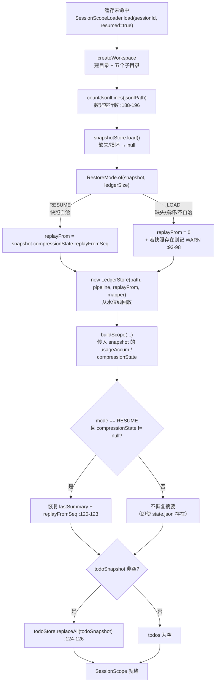
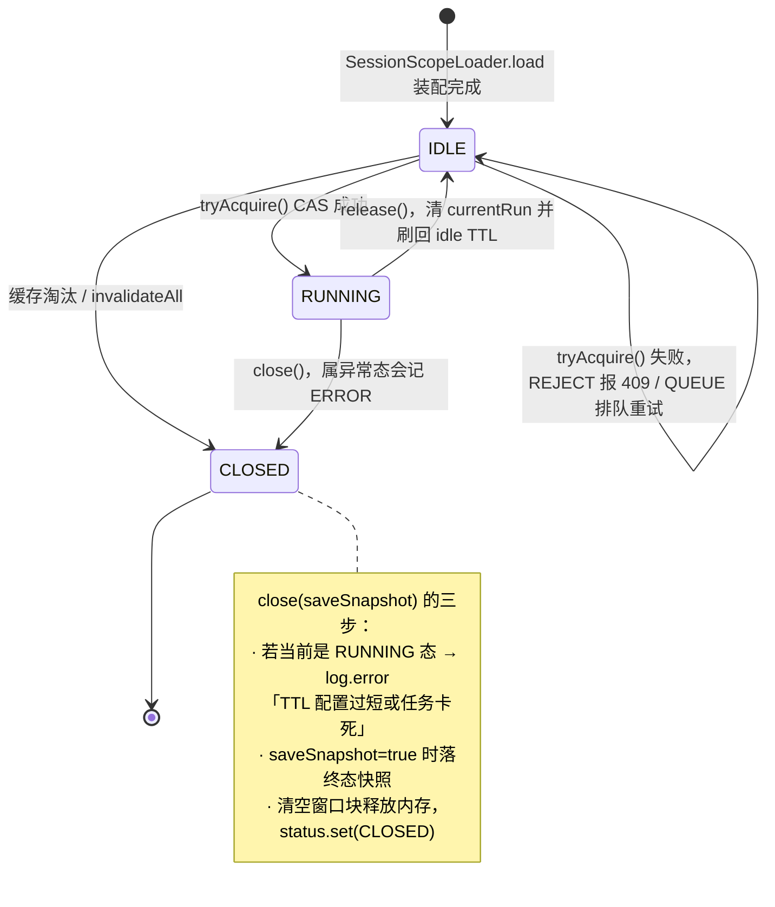

# 06 · 持久化与会话生命周期

> 持久化的核心取舍是**磁盘无损、内存有损、快照只是加速器**：账本永远保存原始消息，内存窗口是可以被压缩破坏的视图，`state.json` 丢失最坏只是多占 token 而不会丢历史。

## 关键类

| 类 | 路径 | 职责 |
|---|---|---|
| `LedgerStore` | `store/ledger/LedgerStore.java` | JSONL 账本 + 内存窗口，`messageSeq` 唯一发放者 |
| `LedgerReplayer` | `store/ledger/LedgerReplayer.java` | 历史 API 的只读回放（与恢复路径无关） |
| `SessionSnapshot` / `SessionSnapshotStore` | `store/snapshot/` | `state.json` 的模型与读写 |
| `RestoreMode` | `store/snapshot/RestoreMode.java` | RESUME / LOAD 的自洽性判定 |
| `ArtifactStore` / `ArtifactRef` | `store/artifact/` | 大工具结果落盘与按 refId 取回 |
| `MemoryStore` | `store/memory/MemoryStore.java` | 跨会话长期记忆（唯一的应用级 store） |
| `TodoStore` / `TodoItem` / `TodoStatus` | `store/todo/` | 进程内待办，仅靠快照持久化 |
| `SessionIndexStore` / `SessionIndexRepository` / `SqliteConfig` | `store/index`、`store/db` | 全局会话索引（SQLite） |
| `SessionScope` / `SessionScopeLoader` / `SessionRegistry` | `runtime/cache/` | 会话装配、缓存门面、状态机 |
| `SessionCacheConfig` / `SessionExpiry` / `SessionScopeRemovalListener` / `SessionLifecycle` | `runtime/cache/` | Caffeine 缓存策略 |

---

## 1. 磁盘布局

`eon.storage.base_dir` 默认 `./home/workspace/sessions`（`src/main/resources/application.yml:81`）。

```
{base_dir}/
├── eon.db                        全局会话索引（SQLite，WAL 模式）
├── memories/                     跨会话共享的长期记忆
│   └── mem_XXXXXXXX.json         {id, title, content, createdAt, updatedAt}
└── {sessionId}/                  每会话一个目录
    ├── ledger.jsonl              只追加的消息账本，永不重写
    ├── state.json                快照：todos + 累计 token + 压缩状态
    ├── scripts/                  脚本目录
    ├── download/                 工作目录（PathResolver 的 workDir，路径沙箱边界）
    ├── upload/                   上传目录
    ├── skills/                   技能目录
    └── tool-results/             落盘的大工具结果
        └── tool-result_00042_read_file.txt
```

会话目录与五个子目录由 `SessionScopeLoader.createWorkspace`（`runtime/cache/SessionScopeLoader.java:162-177`）在装配时创建，任一创建失败都抛 `RuntimeException` 中断装配。`PathResolver` 的 `workDir` 指向 `download`（`:175-176`）——所以**工具的相对路径基准与沙箱边界都是 `download` 目录**，不是会话根目录。

---

## 2. 六个存储的职责边界

| 存储 | 作用域 | 数据 | 落盘方式 | 谁构造 |
|---|---|---|---|---|
| `MemoryStore` | **应用级**（跨会话共享） | `memories/mem_*.json` | 每条目独立文件，覆盖写 | Spring `@Component`（`MemoryStore.java:22-37`） |
| `LedgerStore` | 会话级 | `ledger.jsonl` + 内存 `ContextWindow` | **只追加，永不重写** | `SessionScopeLoader:79`/`:100` |
| `SessionSnapshotStore` | 会话级 | `state.json` | 就地覆盖（tmp + 原子移动） | `SessionScopeLoader:70` |
| `ArtifactStore` | 会话级 | `tool-results/*.txt` | 确定性文件名，幂等覆盖 | `SessionScopeLoader:69` |
| `TodoStore` | 会话级 | **纯内存** `ConcurrentHashMap` | 只通过快照间接持久化 | `SessionScopeLoader:68` |
| `SessionIndexStore` | **应用级** | SQLite `chat_sessions` 表 | SQL | Spring `@Component` |

`MemoryStore` 与 `SessionIndexStore` 是仅有的两个应用级 store；其余四个都随 `SessionScope` 装配、随缓存淘汰而释放。

### `LedgerStore`：账本与窗口的二元结构

`store/ledger/LedgerStore.java:22-25` 的类注释就是设计说明：

> 磁盘 append-only 账本（永不修改）+ 内存 ContextWindow 上下文视图（可改写）。消息序号由本类发放（唯一知道账本长度的地方），回放与常规入站共用序号。

`append(message, succeededToolCalls[, toolResultView])` 是 `synchronized`（`:48-61`），三步顺序固定：

```java
List<ContextBlock> blocks = pipeline.ingest(message, succeededToolCalls, messageCount);  // 入站处置
window.addAll(blocks);                                                                   // 更新内存视图
appendToLedger(message, succeededToolCalls, toolResultView);                              // 写原始消息
messageCount++;                                                                           // 序号递增
```

**`messageCount` 既是账本行数也是 `messageSeq` 的发放器**（`:33-34` 注释）。这个序号是整条压缩链路的坐标：`ContextBlock.messageSeq`、`CompressionState.replayFromSeq`、`ArtifactStore` 的文件名都基于它。

**账本行存的是原始消息**（`SerializedMessage.from`，`:145-175`），入站管线的落盘/截断只影响 `window` 里的块，不影响磁盘行。这是"可恢复"的基础——任何时候都能从账本重建一个未压缩的窗口。

`SerializedMessage` 的字段（`:127-139`）：`type`(system/user/ai/tool)、`content`、`name`(UserMessage 的 name)、`toolCallId`、`toolName`、`success`（仅 tool 行）、`toolResultView`（仅 tool 行）、`toolCalls`、`thinking`。

`loadAll(fromSeq)`（`:93-124`）从指定行起回放，走**与实时入站完全相同的 `pipeline.ingest`**（`:114`），结束时 `messageCount = lines.size()`（`:117`）——注意是**总行数**而不是回放条数，保证后续追加的序号不与已有行冲突。反序列化失败的行记 ERROR 后跳过（`:107-110`）。

### `SessionSnapshotStore`：只存三样

`store/snapshot/SessionSnapshot.java:10-18`：

```java
/** 只存恢复链路消费的三项：todo 列表、累计 token、压缩状态。 */
@JsonInclude(JsonInclude.Include.NON_NULL)
public class SessionSnapshot {
    private List<TodoItem> todoSnapshot;
    private TokenUsage usageAccum;
    private CompressionState compressionState;   // lastSummary + replayFromSeq
}
```

窗口内容**不进快照**——它可以从账本重建。快照只保存"无法从账本推导"的东西。

写入用「临时文件 + 原子移动」（`store/snapshot/SessionSnapshotStore.java:33-58`）：

```java
Path tmp = file.resolveSibling(file.getFileName() + ".tmp");
mapper.writeValue(tmp.toFile(), snapshot);
try {
    Files.move(tmp, file, REPLACE_EXISTING, ATOMIC_MOVE);
} catch (IOException nonAtomic) {
    // 文件系统不支持原子移动时退化为普通替换，tmp 已写完整，内容仍是完整的
    Files.move(tmp, file, REPLACE_EXISTING);
}
```

`load()`（`:60-73`）在文件不存在**或反序列化失败**时都返回 `null`，调用方按无快照处理。损坏的快照不会抛异常中断启动。

序列化器用了 `objectMapper.copy().enable(INDENT_OUTPUT)`（`:30`）——快照是给人看/给人手改的，所以格式化输出。

### `ArtifactStore`：确定性命名换来幂等

`store/artifact/ArtifactStore.java:11-14` 类注释：

> refId 与文件名由消息序号确定性派生（`tool-result_00042_read_file.txt`），回放与常规写入共用路径，重复落盘为幂等覆盖。

```java
String refId = String.format("tool-result_%05d", messageSeq);          // :27
Path filePath = artifactDir.resolve(refId + "_" + source + ".txt");    // :28
```

因为文件名只由 `messageSeq` 和工具名决定，**回放时重新落盘会写到同一路径**，不需要任何"是否已存在"的判断，也不需要在内存里维护 refId→路径 的映射。

`readContent(refId)`（`:41-51`）靠 `resolve` 在目录里 glob `refId + "_*.txt"` 定位文件（`:53-61`）——**无状态**，服务重启后仍能读旧 artifact。这是 `read_file` 工具支持 `artifact://` 前缀的实现基础。

写失败返回 `null`（`:32-35`），`IngestPipeline` 据此降级为"保留原文入窗"。

### `MemoryStore`：跨会话记忆

`store/memory/MemoryStore.java`。目录 `{base_dir}/memories/`，构造时创建（`:29-37`）。

| 方法 | 行为 |
|---|---|
| `create(title, content)` | id = `"mem_" + 8位hex`（`:61`），写 `mem_{id}.json` |
| `update(id, title, content)` | 不存在则抛 `IllegalArgumentException`；null 字段不覆盖；刷新 `updatedAt`（`:69-80`） |
| `delete(id)` | `Files.deleteIfExists`（`:83-93`） |
| `loadAll()` | 过滤 `mem_*.json`，**按 `createdAt` 排序保证注入顺序确定性**（`:95-114`） |
| `renderForInjection()` | 每条渲染为 `- [mem_xxx] title: content(截断 200 字符)`（`:117-126`）→ `<memories>` 锚点层 |
| `renderReferences(text)` | 把 `[[memory:mem_xxx]]` 替换为 `title（content 截断 60 字符）`；找不到则原样保留（`:129-146`） |

`renderReferences` 在任务退出时被调用（`engine/AgentEngine.java:233`、`:248-251`），所以模型可以在回复里用 `[[memory:...]]` 引用记忆，用户看到的是展开后的可读文本。正则限定 `mem_[a-f0-9]+`（`:131`）。

`loadAll` 每次调用都重新列目录读文件——`AgentEngine.buildContext` 每轮都调 `renderForInjection()`，所以**记忆的修改在下一轮就生效**，无需重启。

### `TodoStore`：纯内存 + 单焦点约束

`store/todo/TodoStore.java:10-11`：「进程内存 Map，随会话快照落盘」。

| 方法 | 行为 |
|---|---|
| `replaceAll(newTodos)` | `synchronized`，清空后重填，缺 id 的自动分配（`:20-30`） |
| `mergeById(newTodos)` | `synchronized`，已存在 id 更新、新 id 追加（`:33-42`） |
| `clear()` | `synchronized`，「全部完成/取消后调用，使 Todo 不再注入上下文」（`:44-48`） |
| `getAll()` | 按 id 排序返回（`:51-55`） |
| `validateSingleFocus(list)` | **同时最多一个 `IN_PROGRESS`**（`:57-63`） |
| `formatProgress(list)` | `N/M 完成 (x 进行中, y 待办, z 阻塞)`（`:71-77`） |

id 由 `AtomicInteger` 生成 `"t" + n`（`:80-82`）。`TodoStatus` 五值：PENDING / IN_PROGRESS / COMPLETED / BLOCKED / CANCELLED，各带 emoji 图标。

`validateSingleFocus` 由 `TodoWriteTool` 调用——这是"计划必须有唯一当前焦点"的强制约束。

### `SessionIndexStore` + SQLite

`store/db/SqliteConfig.java:60-89` 建表（`CREATE TABLE IF NOT EXISTS`）：

```sql
CREATE TABLE IF NOT EXISTS chat_sessions (
    session_id          TEXT PRIMARY KEY,
    user_id             TEXT NOT NULL,
    title               TEXT,
    created_at          TEXT NOT NULL,
    last_active_at      TEXT NOT NULL,
    message_count       INTEGER NOT NULL DEFAULT 0,
    user_message_count  INTEGER NOT NULL DEFAULT 0,
    updated_at          TEXT NOT NULL DEFAULT (datetime('now'))
);
CREATE INDEX IF NOT EXISTS idx_sessions_user ON chat_sessions(user_id, last_active_at DESC);
```

PRAGMA：`journal_mode=WAL`（读写并发不互斥）、`foreign_keys=ON`（`:64-67`）。DataSource 用 SQLite JDBC 内置连接池 `org.sqlite.SQLiteDataSource`（`:48-49`），`:31-34` 注释说明理由：避免每次操作都 `DriverManager.getConnection()` 创建裸连接；WAL 与外键在首次连接时设置，后续池中连接继承。

`SessionIndexStore`（`store/index/SessionIndexStore.java`）的操作：

| 方法 | 调用时机 |
|---|---|
| `insert(sessionId, userId, title)` | 新建会话时（`ChatServiceImpl:75`） |
| `incrementUserMessageCount(sessionId)` | 已有会话收到新用户消息（`ChatServiceImpl:84`） |
| `touch(sessionId, messageCount)` | **任务结束时**（`ChatServiceImpl:133`），更新活跃时间与账本消息总数 |
| `list(userId)` | 按 `lastActivityAt` **倒序**（`:41-46`） |
| `find(userId, sessionId)` | 续接会话时解析完整 ID（`ChatServiceImpl:79`） |
| `delete(userId, sessionId)` | **硬删除** |

`delete`（`:52-61`）是硬删：先删 SQLite 行，成功后**递归删除整个会话目录**（`deleteDirectory:88-98`，用 `Files.walk` + `Comparator.reverseOrder()` 保证先删子项）。删失败只记日志不抛异常。

`toMeta`（`:78-86`）在 `title` 为 null 时回退用 `sessionId` 当标题。

---

## 3. 恢复流程与 `RestoreMode`

缓存未命中且 `resumed=true` 时走这条路径（`runtime/cache/SessionScopeLoader.java:87-129`）。



### `RestoreMode.of` 的自洽性判定

`store/snapshot/RestoreMode.java:23-30`：

```java
public static RestoreMode of(SessionSnapshot cp, long ledgerSize) {
    if (cp == null || cp.getCompressionState() == null) return LOAD;
    CompressionState cs = cp.getCompressionState();
    int replayFrom = cs.getReplayFromSeq();
    boolean hasSummary = cs.getLastSummary() != null && !cs.getLastSummary().isBlank();
    boolean inRange = replayFrom >= 0 && replayFrom <= ledgerSize;
    return inRange && (replayFrom > 0) == hasSummary ? RESUME : LOAD;
}
```

三个条件必须同时满足才 RESUME：

1. `compressionState` 存在
2. `0 <= replayFrom <= ledgerSize`（水位线不能越过账本长度）
3. **`(replayFrom > 0) == hasSummary`**——水位线与摘要必须同时有或同时无。这条排除了两种危险状态：有水位线但摘要丢了（会永久丢失那段历史），有摘要但水位线是 0（摘要会被重复计入，历史消息也在窗口里）。

`:20-22` 的注释说明了降级方向的选择：

> 不自洽时降级为 LOAD：全量回放最坏是多占 token，按坏快照回放会静默丢历史。

**LOAD 模式下即使 `state.json` 存在也不恢复摘要**（`:120` 的 `mode == RESUME` 判断）——因为无法确定摘要覆盖到哪一行，用了就可能与全量回放的历史重复。此时 `usageAccum` 仍会恢复（`:115`），token 累计不会因为快照不自洽而清零。

### 两条互不相干的回放路径

这是最容易混淆的一点：

| | `LedgerStore.loadAll(fromSeq)` | `LedgerReplayer.replay(path)` |
|---|---|---|
| 用途 | **会话恢复**——重建内存窗口 | **历史 API**——`GET /api/sessions/{id}` |
| 起点 | `replayFromSeq`（水位线之后） | **始终第 0 行**，无视压缩 |
| 是否走 IngestPipeline | 是（会重新落盘、重新格式化） | 否（只做 `SerializedMessage` → `AgentEvent` 映射） |
| 产出 | `ContextWindow` 的块 | `List<AgentEvent>` |
| 是否装配会话 | 是 | **否**，只需账本文件路径 |
| 位置 | `store/ledger/LedgerStore.java:93-124` | `store/ledger/LedgerReplayer.java:37-70` |

结论：**前端看到的永远是完整未压缩的历史，而 LLM 窗口可能是压缩过的**。两者不一致是设计使然，不是 bug。

`LedgerReplayer` 是 `@Component`（`:23-24`），被 `SessionServiceImpl.getSessionEvents` 调用（详见 [05-events-api.md](05-events-api.md)）。

---

## 4. Caffeine 会话缓存

### 构建（`runtime/cache/SessionCacheConfig.java:18-34`）

```java
return Caffeine.newBuilder()
        .maximumSize(c.getMaximumSize())                    // 默认 1000
        .expireAfter(new SessionExpiry(idleTtl, runningTtl)) // 变长过期
        .removalListener(removalListener)
        .executor(Runnable::run)                            // 同步执行淘汰回调，避免 close() 延迟
        .recordStats()
        .build();
```

`.executor(Runnable::run)` 是个关键选择（`:30` 注释）：默认 Caffeine 用 `ForkJoinPool.commonPool()` 异步跑移除监听器，这里改成**同步**，保证 `SessionScope.close()`（含快照落盘）在淘汰发生的那一刻就完成，不会延迟到某个不确定的后台时机。

### 变长过期（`runtime/cache/SessionExpiry.java`）

`Expiry` 的三个回调**全部返回同一个 `ttl(value)`**（`:19-31`）：

```java
private long ttl(SessionScope value) {
    return value.status() == SessionLifecycle.RUNNING ? runningNanos : idleNanos;
}
```

即 **create / update / read 三处都会重算 TTL**。`expireAfterRead` 也重算是重点：一次读操作就能把 RUNNING 会话的 TTL 续到 1440 分钟，保证执行中的会话不会因为耗时长而被淘汰。

默认值：`idle_ttl_minutes=30`、`running_ttl_minutes=1440`（24h，注释「兜底防长任务被淘汰」）。

任务结束后 `SessionRegistry.release` 会调 `touch`（`runtime/cache/SessionRegistry.java:85-89`）**显式把 TTL 改回 idle 值**：

```java
cache.policy().expireVariably().ifPresent(p -> p.setExpiresAfter(sessionId, idle));
```

否则一个跑过任务的会话会一直挂着 24h 的 TTL 占内存。

### 单飞装配与并发互斥

`SessionRegistry.acquire`（`:43-69`）：

```java
SessionScope scope = cache.get(sessionId, k -> loader.load(k, resumed));   // Caffeine 按 key 原子加载
if (scope.tryAcquire()) return scope;                                      // CAS IDLE→RUNNING
if (isQueuePolicy()) { ... }                                               // QUEUE：限时排队
throw ApiException.sessionBusy(sessionId);                                 // REJECT：409
```

两层保护，解决两个不同的问题：

| 层 | 机制 | 解决的问题 |
|---|---|---|
| 装配 | `cache.get(key, mappingFunction)` 的按 key 原子性 | 并发请求同一未缓存会话时**只装配一次**（`:18` 注释「同 key 只装配一次」） |
| 执行 | `SessionScope.tryAcquire()` 的 CAS | 同一会话**同时只有一个 run**（`SessionScope.java:23` 注释） |

QUEUE 模式（`busy_policy=QUEUE`）：`runLock().tryLock(queueTimeoutSeconds, SECONDS)` 等待前一个任务结束，然后**重新 `tryAcquire`**（`:61-64`）；超时或重抢失败都回退为 `sessionBusy`。`queueTimeoutSeconds()`（`:124-128`）在配置值 ≤0 时回退 60s，注释说明理由：「避免误配成 0 导致排队模式形同 REJECT」。

`release`（`:71-83`）只在 `runLock().isHeldByCurrentThread()` 时才 unlock（`:77-80`）——REJECT 模式下根本没抢锁，无条件 unlock 会抛 `IllegalMonitorStateException`。

`find`（`:91-94`）只读缓存不触发装配，供 `interrupt` 使用（避免为了中断一个不存在的会话而把它装配出来）。

---

## 5. 会话生命周期状态机



`SessionLifecycle` 三值：`IDLE` / `RUNNING` / `CLOSED`。状态存放在 `AtomicReference<SessionLifecycle>`（`runtime/cache/SessionScope.java:48`），转换全靠 CAS：

```java
public boolean tryAcquire() { return status.compareAndSet(IDLE, RUNNING); }   // :85-87
public void release() {                                                        // :90-93
    currentRun.set(null);
    status.compareAndSet(RUNNING, IDLE);
}
```

`currentRun` 是另一个 `AtomicReference<RunContext>`（`:49`），在 `RunContext` 构造时通过 `session.bindRun(this)` 绑定（`runtime/RunContext.java:33`），供 `POST /api/interrupt` 找到活的 run。

---

## 6. 淘汰落盘 vs 显式删除不落盘

`runtime/cache/SessionScopeRemovalListener.java:18-24`：

```java
public void onRemoval(String key, SessionScope value, RemovalCause cause) {
    if (value == null) return;
    boolean explicit = cause == RemovalCause.EXPLICIT;
    log.info("会话 {} 移出缓存: cause={}, 落快照={}", key, cause, !explicit);
    value.close(!explicit);
}
```

| 淘汰原因 | `cause` | 是否落快照 | 理由 |
|---|---|---|---|
| TTL 过期 / 超容 | `EXPIRED` / `SIZE` | **是** | 会话还要用，必须保住恢复状态 |
| `invalidate()`（删会话） | `EXPLICIT` | **否** | `SessionScope.java:134-135` 注释：「避免把快照写进一个正在删除的目录」 |
| `invalidateAll()`（进程退出） | `EXPLICIT` | **否** | 但每个任务结束时已经存过快照，所以不丢数据 |

`close(saveSnapshot)`（`runtime/cache/SessionScope.java:137-155`）的三步：

1. 若当前是 `RUNNING` → `log.error("会话 {} 在 RUNNING 状态被关闭：TTL 配置过短或任务卡死")`（`:138-140`）。这是排查长任务被误淘汰的关键日志。
2. 按需 `saveSnapshot()`，失败只 WARN 不抛（`:141-147`）
3. `ledger.window().removeBefore(size)` 清空窗口块释放内存（`:148-152`），然后 `status.set(CLOSED)`

### 快照保存的三个时机

| 时机 | 触发者 | 说明 |
|---|---|---|
| 每次任务结束 | `RunContext.close()` → `session.saveSnapshot()`（`runtime/RunContext.java:59-67`），由 `ChatServiceImpl.execute` 的 finally 调用（`:136-138`） | **主路径**。引擎自身不存快照（`engine/AgentEngine.java:246` 注释：「任务结束落盘统一收敛到 RunContext#close()」） |
| 每次 `todo_write` 成功 | `SessionSnapshotHook`（PostTool, order=200） | 任务中期的检查点，长任务被杀时能少丢进度 |
| 缓存淘汰 / 进程退出 | `SessionScopeRemovalListener` → `close(true/false)` | **安全网**，非唯一保障 |

`saveSnapshot()`（`SessionScope.java:119-123`）在 `snapshotEnabled=false` 时是空操作，开关来自 `eon.mode.snapshot_enabled`，在装配时读一次存为 final 字段（`:33`、`:67`，`SessionScopeLoader.java:144`）。

`RunContext.close()` 只保存快照，**不释放状态机**——`:59` 注释明确：「不释放会话状态机（由 SessionRegistry 负责）」。释放顺序在 `ChatServiceImpl.execute` 的嵌套 finally 里（`:129-139`）：`interactions.cancel` → `indexStore.touch` → `registry.release` → `ctx.close()`。

---

## 相关篇章

- [02-context.md](02-context.md) — `ContextWindow` / `IngestPipeline` / `CompressionState` 的内部机制，`replayFromSeq` 如何被 SUMMARIZE 推进
- [01-engine.md](01-engine.md) — `TurnMessageWriter.flush` 如何写账本、`RunContext.close()` 在任务收尾的位置
- [03-hooks.md](03-hooks.md) — `SessionSnapshotHook` 与 `ToolCircuitBreaker` 的 session 级归属
- [05-events-api.md](05-events-api.md) — `LedgerReplayer` 的事件映射规则与历史 API
- [07-configuration.md](07-configuration.md) — `eon.storage.*` / `eon.session.cache.*` / `eon.mode.*`
- [08-design-gaps.md](08-design-gaps.md) — 熔断器状态跨任务泄漏（与 session 级归属直接相关）
