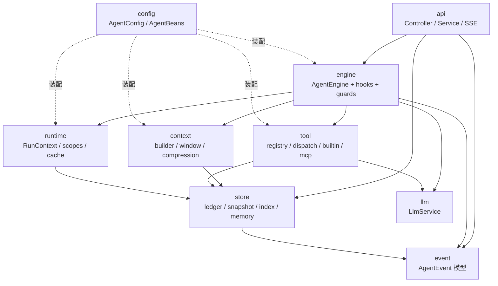
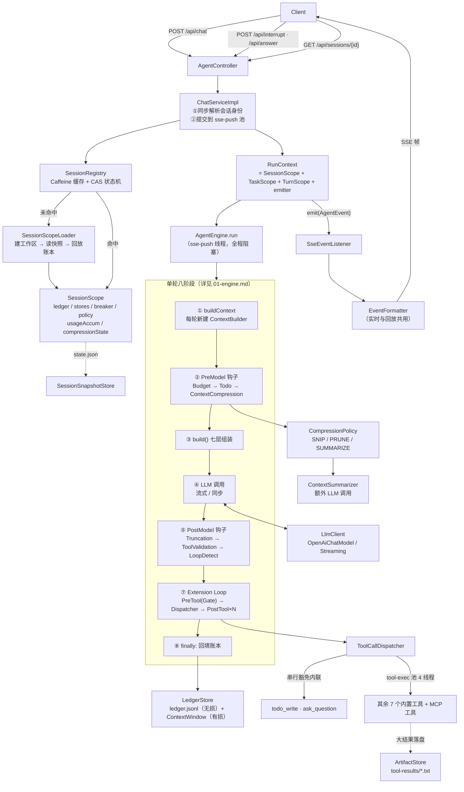

# eon-agent 架构文档

Java 17 / Spring Boot 3.4.5 / LangChain4j 1.18 实现的 **LLM Agent 后端**：对外提供 HTTP + SSE 接口，内部驱动一个带工具调用、上下文压缩、四阶段钩子与多层守卫的 Agent 循环。

这套文档面向**要改代码的人**：每个论断都带 `路径:行号` 锚点（相对 `src/main/java/cn/kong/eon/`，资源文件写全路径），照着就能跳到源码。

---

## 文档索引

| 篇章 | 内容 | 什么时候读 |
|---|---|---|
| [01-engine.md](01-engine.md) | 主循环、单轮八阶段流水线、五类终止条件、中断机制、三层作用域、并发模型 | 要改循环控制、终止逻辑、作用域 |
| [02-context.md](02-context.md) | ContextBlock 模型、七层组装、token 口径、两套体积防线、三档压缩、摘要生成 | 要改上下文组装或压缩策略 |
| [03-hooks.md](03-hooks.md) | Hook SPI、发现与排序、短路语义、10 个具体钩子、3 个守卫、扩展指南 | **要新增钩子** |
| [04-tools.md](04-tools.md) | 两段式工具 SPI、9 个内置工具、参数纠偏、权限与沙箱、并行派发、MCP、人机交互 | **要新增工具**、要改派发或 MCP |
| [05-events-api.md](05-events-api.md) | 14 个事件全表、SSE 编码链、HTTP 端点全表、错误契约、LLM 层流式与重试 | 要改前端契约、加端点、调 LLM 行为 |
| [06-persistence.md](06-persistence.md) | 磁盘布局、6 个存储的职责边界、恢复模式、两条回放路径、Caffeine 缓存、生命周期状态机 | 要改落盘、恢复、缓存策略 |
| [07-configuration.md](07-configuration.md) | `application.yml` 全量键表（默认值 / 含义 / 生效位置）、环境变量、耦合约束、装配入口 | 要调参、排查配置未生效 |
| [08-design-gaps.md](08-design-gaps.md) | 6 条已验证的设计缺口（根因 + 根治方向）+ 9 条易误解的设计取舍 | 要重构、或读到"看起来不对"的代码时先查这里 |

**推荐阅读顺序**：本页 → 01 → 03 → 02 → 04，其余按需查阅。

---

## 技术栈

| 依赖 | 版本 | 用途 |
|---|---|---|
| Spring Boot | 3.4.5（parent，`pom.xml:7-13`） | Web MVC + `SseEmitter`，**非 WebFlux** |
| Java | 17（`pom.xml:23`） | record / switch 表达式 / text block |
| LangChain4j | 1.18.0（`pom.xml:24`） | `OpenAiChatModel` / `OpenAiStreamingChatModel` / `ToolSpecification` / 消息模型 |
| langchain4j-mcp | 1.18.1-beta28（`pom.xml:25`） | MCP 客户端（Streamable HTTP transport） |
| Caffeine | 由 parent 管理（`pom.xml:83-87`） | 活跃会话上下文缓存 |
| sqlite-jdbc | 3.46.1.0（`pom.xml:89-94`） | 全局会话索引 |
| jsoup | 1.18.1（`pom.xml:62-67`） | `web_fetch` 提取网页元信息 |
| flexmark-html2md-converter | 0.64.8（`pom.xml:69-74`） | `web_fetch` 的 HTML → Markdown |
| commons-lang3 | 3.20.0（`pom.xml:76-81`） | `StringUtils` 等工具方法 |

模型接入用 OpenAI 兼容协议，实际服务商是小米 MiMo（`eon.llm.base_url` = `https://api.xiaomimimo.com/v1`，模型 `mimo-v2.5`）。

---

## 包结构与依赖方向

```
cn.kong.eon
├── api/          HTTP 层：Controller、Service、DTO、SSE 编码、全局异常
│   ├── dto/          请求/响应 record
│   ├── exception/    ApiException + GlobalExceptionHandler
│   ├── service/      ChatService（对话编排）、SessionService（索引与回放）、FileService（文件访问）
│   └── sse/          EventFormatter（事件→Map）、SseEventListener（Map→SSE 帧）
├── config/       组合根：AgentConfig（配置绑定）、AgentBeans（应用级装配）、Executor/Http/ObjectMapper
├── engine/       ★ 引擎：AgentEngine 主循环、LoopAction
│   ├── exec/         ToolCallDispatcher（派发）、TurnMessageWriter（回填）
│   ├── guard/        LoopDetector、ProgressTracker、ToolCircuitBreaker
│   ├── hook/         Hook SPI + HookDispatcher + HookResult
│   │   ├── premodel/     BudgetHook、TodoContextHook、ContextCompressionHook
│   │   ├── postmodel/    TruncationHook、ToolValidationHook、LoopDetectHook
│   │   ├── pretool/      GateHook
│   │   └── posttool/     ToolFailureHook、TodoNoProgressHook、SessionSnapshotHook
│   └── stop/         StopCategory、StopHandler
├── context/      ★ 上下文：ContextBuilder、ContextWindow、CompressionState、ContextMetrics、ContentCompressor
│   ├── block/        ContextBlock、BlockKind、CompressionLevel、MessageBlockCodec
│   ├── dynamic/      EnvironmentContext
│   ├── pipeline/     IngestPipeline（入站唯一关卡）
│   ├── policy/       CompressionPolicy、CompressionSettings
│   └── summary/      ContextSummarizer
├── event/        事件模型：AgentEvent + 14 个事件 record + Visitor + Listener
├── llm/          LLM 抽象：LlmService、LlmClient、LlmResponse、TokenUsage、ToolCallDelta、LlmStalledException
├── runtime/      作用域：RunContext、TaskScope、TurnScope、InteractionGateway
│   └── cache/        SessionScope、SessionScopeLoader、SessionRegistry、Caffeine 策略
├── store/        持久化
│   ├── artifact/     ArtifactStore（大工具结果落盘）
│   ├── db/           SqliteConfig、SessionIndexRepository
│   ├── index/        SessionIndexStore、SessionMeta
│   ├── ledger/       LedgerStore（JSONL 账本）、LedgerReplayer（历史 API）
│   ├── memory/       MemoryStore（跨会话记忆）
│   ├── snapshot/     SessionSnapshot、SessionSnapshotStore、RestoreMode
│   └── todo/         TodoStore、TodoItem、TodoStatus
└── tool/         ★ 工具：ToolService、ToolDescriptor、ToolExecutor、ToolRuntime、ToolResult、
                     ArgumentTypeCoercer、PathResolver、ToolPermission、QuestionChannel、RemoteToolInvoker
    ├── builtin/      9 个内置工具
    ├── mcp/          McpServerClient
    └── model/        ToolCallRecord、ToolResultView
```

★ = 本次文档的四个重点模块。

### 依赖方向



几条值得注意的边界：

- **工具看不到 `RunContext`**。`ToolCallDispatcher` 把它投影成 `ToolRuntime` record（store + 回调），所以工具无法发事件、无法访问引擎状态。
- **钩子必须无状态**。跨轮状态一律外置到 `TaskScope` / `SessionScope`，钩子是可被多会话共享的应用级单例。
- **`context` 不依赖 `engine`**。压缩由 `ContextCompressionHook`（在 engine 侧）主动调用 `CompressionPolicy`（在 context 侧），方向是单向的。
- **`event` 是纯数据层**，不依赖任何业务包，所以实时与回放两条链路能共用 `EventFormatter`。
- **`config` 是组合根**。`ToolService` 和 `CompressionPolicy` 都不是 `@Component`，而是在 `AgentBeans` 里手工装配——这让"注册哪些工具、用什么压缩参数"成为显式代码而非扫描结果。

---

## 全景架构



---

## 三层作用域模型

引擎只认 `RunContext` 一个参数，所有可变状态分三层存放。**理解这三层的生命周期差异，是读懂整个项目的前提。**

| 作用域 | 生命周期 | 装什么 | 并发约定 |
|---|---|---|---|
| **`SessionScope`**<br/>`runtime/cache/SessionScope.java` | 跨任务，由 Caffeine 缓存管理（idle 30min / running 1440min） | 不变依赖：ledger、todoStore、artifactStore、snapshotStore、memoryStore、pathResolver、circuitBreaker、compressionPolicy<br/>跨任务累计：usageAccum、compressionState | `AtomicReference<SessionLifecycle>` CAS + `ReentrantLock`；同会话同时只允许一个 run |
| **`TaskScope`**<br/>`runtime/TaskScope.java` | 一次 `run()`，结束即丢弃 | userInput、turnId（**任务级常量**）、nudges、turnCount、loopDetector、progressTracker | 只有 `interrupted` 是 `volatile`（HTTP 线程写）；其余假定单 run 线程访问 |
| **`TurnScope`**<br/>`runtime/TurnScope.java` | 一轮循环，`nextTurn()` 时**整体替换** | index、messageId（**每轮唯一**）、prompt(ContextBuilder)、response、assistantText、thinking、pendingToolCalls、toolResults | 非 volatile，安全前提是只有 run 线程替换它；并行工具线程只读 |

三层的归属差异会造成实际后果：`LoopDetector` 是 task 级所以每个任务重新计数，`ToolCircuitBreaker` 是 session 级所以熔断状态会跨任务残留——后者是一个已确认的设计缺口，见 [08-design-gaps.md](08-design-gaps.md) 第 5 条。

---

## 并发模型

**全阻塞 + 平台线程。没有 WebFlux，没有虚拟线程，没有响应式流。**

| 线程池 | 定义 | 类型 | 职责 |
|---|---|---|---|
| `sse-push` | `config/ExecutorConfig.java:18-25` | `newCachedThreadPool`，daemon | 跑整个 task。run 线程全程阻塞在 LLM 调用和工具执行上 |
| `tool-exec` | `engine/exec/ToolCallDispatcher.java:49-55` | `newFixedThreadPool(4)`，daemon | 跑非串行豁免的工具。**跨会话共享**，`@PreDestroy` 优雅关闭 |

HTTP 请求线程只做两件事：同步解析会话身份（新建 UUID / 续接查索引）、把任务提交给 `sse-push` 池，然后立即返回 `SseEmitter`。会话 id 由**首帧 `session.start`** 交付，不在 HTTP 响应体里。

流式 LLM 的 delta 回调运行在 **HTTP 客户端的回调线程**上，直接调 `r.emit(...)` 发 SSE，不经过 run 线程。

两处"阻塞等待用户"的设计需要注意：`ask_question` 会阻塞 run 线程最长 600s，所以 `SseEmitter` 超时被设为 1800s（覆盖"执行 + 多次提问等待"）。详见 [04-tools.md](04-tools.md) 第 9 节。

---

## 一次任务的数据流

```
POST /api/chat
  ↓ 同步：解析会话身份（新建 UUID / 查索引取完整 ID）→ 返回 SseEmitter
  ↓ 异步（sse-push 线程）：
     SessionRegistry.acquire  → 缓存命中或装配 SessionScope（含账本回放）
     RunContext 构建          → SessionScope + TaskScope + SseEventListener
     AgentEngine.run
       initRun                → ledger.append(原始 UserMessage)
       loop（≤ max_steps 轮）：
         buildContext         → 每轮新建 ContextBuilder（summary/environment/memories 重算）
         PreModel 钩子        → 预算检查、todo 渲染、水位压缩（可能触发额外 LLM 调用）
         build()              → 七层 messages
         LLM 调用             → 流式 delta 直发 SSE
         PostModel 钩子       → 截断/工具存在性/循环检测
         无工具调用？          → 是：emit engine.message，任务完成
         Extension Loop       → Gate 门禁 → 派发执行（串行豁免内联 / 其余进池）→ 逐个 PostTool
         finally              → TurnMessageWriter.flush：AiMessage + ToolExecutionResultMessage 落账本
                                  ↓ 入站管线：大结果落盘为 artifact://，其余套展示外壳
       completeExit           → 渲染 [[memory:...]] 引用 → session.usage → session.status idle
     finally                  → interactions.cancel → index.touch → registry.release → ctx.close()（存快照）
```

---

## 核心不变式

改动代码前需要知道的、被多处逻辑依赖的约束：

1. **账本只追加、永不重写**（`store/ledger/LedgerStore.java:22-25`）。压缩只作用于内存 `ContextWindow`，磁盘行永远是原始消息。这是"任何时刻可重建完整历史"的基础。
2. **`messageSeq` 只由 `LedgerStore` 发放**（等于账本行数）。`ContextBlock.messageSeq`、`CompressionState.replayFromSeq`、`ArtifactStore` 的文件名都基于它。
3. **带 `tool_calls` 的 AiMessage 后面必须跟齐对应的工具结果**。两处保障：`TurnMessageWriter:27-30` 只在真正派发过工具时才写 `tool_calls`；`ContextWindow.repairPairing()` 在 SUMMARIZE 删块后修复配对。违反会被 LLM 服务端直接拒绝请求。
4. **尾部 12 个块永不被处置**（`eon.context.compression.tail_guard_blocks`）。最近的对话细节始终以原文在场。
5. **用户消息只有"原文保留"与"被摘要吸收后删除"两个状态**（`context/policy/CompressionPolicy.java:129-130`），绝不做就地截断。摘要 prompt 因此要求逐字照抄 `<user_input>` 原文。
6. **工具是无状态应用级单例**，会话级对象只能通过 `ToolRuntime` 参数在 `execute()` 方法内使用，严禁存进字段（`tool/ToolRuntime.java:8-11`）。
7. **钩子是无状态应用级单例**，跨轮状态必须外置到 `TaskScope` / `SessionScope`（`engine/hook/Hook.java:10-12`）。
8. **同一会话同时只允许一个 run**（`SessionScope.tryAcquire()` 的 CAS）。违反时按 `busy_policy` 返回 409 或排队。
9. **摘要必须先写入状态、再删除原文**（`CompressionPolicy.java:56-57`）。顺序颠倒会在摘要失败时永久丢历史。
10. **`summarize_max_output_chars` ≤ `llm.max_tokens`**（`src/main/resources/application.yml:43-45`）。违反会导致残缺摘要被静默存下并在下一轮继续被压。

---

## 未纳入本文档范围的类

以下类在上述篇章中未被展开，列出以便查阅时不留盲区：

| 类 | 说明 |
|---|---|
| `store/index/SessionMeta` | 索引查询结果的 record，字段见 [06-persistence.md](06-persistence.md) 第 2 节 |
| `store/db/SessionIndexRepository` | SQLite CRUD，SQL 语句细节未展开 |
| `store/todo/TodoItem` / `TodoStatus` | `TodoStatus` 五值与 emoji 图标见 [06-persistence.md](06-persistence.md) |
| `store/artifact/ArtifactRef` | `record(refId, path)`，`ArtifactStore.save` 的返回值 |
| `llm/TokenUsage` | 可变累加器，`add()` / `zero()` / 三个 getter |
| `llm/LlmResponse` | `record(aiMessage, usage, finishReason)` |
| `llm/ToolCallDelta` | `record(index, id, name, partialArgs)`，仅进度展示用 |
| `tool/InteractionRequest` / `InteractionAnswer` | 提问的载荷与答案 record |
| `config/HttpConfig` / `ObjectMapperConfig` | 工具共用的 `HttpClient` 与全局 Jackson 配置 |
| `runtime/cache/SessionLifecycle` | 三值枚举 IDLE / RUNNING / CLOSED |
| `src/main/resources/logback.xml` | 日志配置，未审查 |

---

## 文档维护约定

- 正文中文，代码标识符 / 配置键 / 事件名保持原文
- 每个论断带 `路径:行号` 锚点，路径相对 `src/main/java/cn/kong/eon/`（资源文件写全 `src/main/resources/...`）
- 引用源码用短片段（≤10 行）并标行号，不整文件粘贴
- 01~07 篇只客观描述现状；所有"这里应该改"的判断集中在 [08-design-gaps.md](08-design-gaps.md)
- 改代码时若触及某篇描述的行为，同步更新对应篇章与行号锚点

文档基于分支 `v1`（提交 `da735c7`）的源码状态生成。
